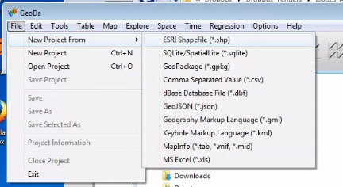
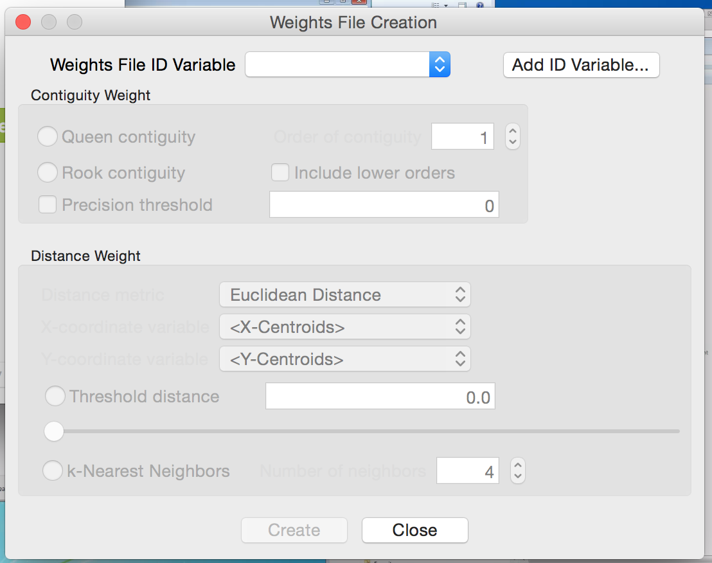
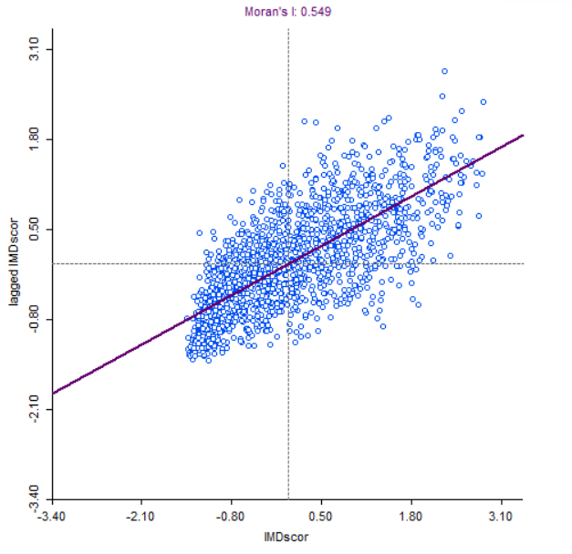
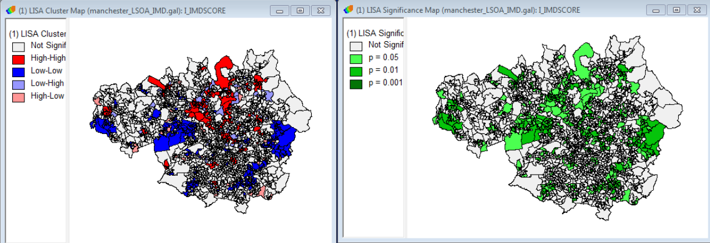
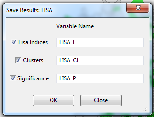
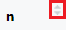

```{r setup, echo=FALSE}
#set working directory to /data-user
knitr::opts_knit$set(root.dir = 'C:/Users/nick/Documents/work/advanced-r-gis/data-user')
```

Learning Outcomes: | Concepts & R Functions:  
-------- | --------  
Understand linked displays in GeoDa |  brushing *p1*  
Be able to interpret Spatial Autocorrelation | Moran's I *p3* 
Perform Local Indicators of Spatial Association | LISA *p3*  
Calculate Moran's I and LISA in R | `rgeoda()` *p5*
Perform Point in Polygon analysis | `st_join()` *p13*
Know how to reorder data | `order()` *p15*  
Know how to use buffers within R  | `st_buffer()` *p16*   
Pros and cons using point or polygon data | `st_centroid()` *p23*
<!-- Tables have a max line length, if it is too long, the table gets shrunk -->


# Practical 1: Spatial Statistics

*Remember for the GeoDa bit, I will be walking through the process on screen. You can start from the section **Moran's I and LISA in R**, calculating these statistics in R on page 5*

We are going to be performing some Exploratory Data Analysis using a program called GeoDa. The data we are using covers Manchester, UK. 

For the analysis, we are interested in the deprivation levels. First of all, let's have a look at the data in a program called GeoDa.

Download the `tram.zip` data the website and extract the zip file. 

- Click **Start > GeoDa** 
- When GeoDa opens, click on the folder icon 
- Select **ESRI Shapefile (.shp)** 
- Browse to and open **lsoa_manchester_age_imd.shp** 

{ height=30% }


GeoDa should open a map display of the data automatically. We can create a simple choropleth map in here by right clicking on the map and then select **Change Current Map Type**. Select **Natural Breaks > 5** and choose the variable to map (we want **IMDscor**). Then a classified map will appear, similar to one we have created in RStudio. 

Also open the attribute table { height=30 } and a histogram { height=30 } for `IMDscor`. GeoDa allows us to use brushing or linked displays. Select one of the larger bars in the histogram and you will see that the same entries are highlighted on the map and in the attribute table. You can also draw a box on the map (left-click and drag) and that will highlight the entries as well (you can drag the box around). 

*How is this different to interacting with the data in RStudio, or QGIS/ArcGIS if you have used those packages? Is it better / easier to use? Or harder to use?*

We will now perform some spatial analysis within GeoDa. There is some preparatory work to do beforehand, which is creating the spatial weights. This is how GeoDa works out which polygons are next to each other and which ones to include when running local analysis (these are how we define 'neighbours', as I mentioned in the presentation).

Select **Tools > Weights Manager** and click **Create**.  The following screen is displayed. 

{ height=40% }

- Select **Add ID Variable...** and accept the default name.  
- You now need to choose the neighbourhood weight method.  Select **Queen contiguity** and click **Create**.  
- The neighbourhood weight matrix is saved in a file.  A suggested name is given.  This is the LSOA shape file name with a suffix of .gal.  Select **Save** and after a few seconds you should see a message **Weights file `lsoa_manchester_age_imd.gal` created successfully**.  
- Click **OK** on this window and **Close** on the Weights File Creation window. The Weights Manager window should show the details of the neighbours you have just selected. 

Click { height=20 } within the Weights Manager window and you can see how many neighbours each polygon has. In my data, five is the most common number of neighbours. Close this and open the **Connectivity Map**, which shows the neighbours for each polygon. Close this and the Weights Manager when you are happy with it. 

## Moran's I

We can now start to explore the spatial patterns of the model we want to develop.  Click on the **Space** item on the GeoDa menu.  First we are going to look at the global indicator of spatial autocorrelation.  Select the first menu item **Univariate Moran's I**.  A list of variables is displayed.  Choose the `IMDscor` variable.  Select the weights file we created earlier. 

{ height=40% }

A new window opens with a scatter plot of the IMDscor variable and the lagged IMDscor variable.  The lagged IMDscor variable is the value of the IMD Score for the selected neighbourhood and its neighbours as defined when we set the spatial weights.  The scatter-plot suggests a positive correlation between the variables.  This means that there is a weak positive spatial autocorrelation. It has a value of 0.549 confirming this positive spatial autocorrelation. We will now look at the local indicators of spatial association.  

## Local Indicators of Spatial Association (LISA)

- Select **Space > Univariate Local Moran's I**. 
- Select the `IMDscor` variable from the list displayed and select the weights file used earlier (it should be selected automatically). 
- A screen with three check boxes is shown.  Check all three and click **OK**.  A number of windows are produced. 
- The scatter plot is the same as we produced in the previous section. The two maps shown below are produced.  You will probably need to expand them to full screen to see the legends and patterns displayed. 

{ height=35% }

The first map shows the extent to which neighbouring areas are clustered:  
  
- red areas are neighbourhoods with a high proportion of deprived areas surrounded by similar neighbourhoods 
- darker blue areas are neighbourhoods with a low proportion of deprived areas surrounded by similar neighbourhoods 
- lighter blue areas are neighbourhoods with a low proportion of deprived areas surrounded by neighbourhoods with a high proportion of deprived areas 
- pink areas are neighbourhoods with a high proportion of deprived areas surrounded by neighbourhoods with a low proportion of deprived areas 
- white areas are neighbourhoods where the surrounding neighbourhoods do not generate a statistically significant relationship. 

The second map shows the level of statistical significance.  The values are 0.05, 0.01 and 0.001.

We can see that areas of high and low deprivation cluster together.

Now that we have the clustering output, we can save these to the shapefile and then load them into R to map or to do other analysis. *Moving data from one GIS application to another is something that happens regularly with many of the projects I am working on!* 

Right click on the map and choose **Save Results**. Tick all three boxes (to save all of the results). This will create a new variable in the shapefile for each of the results we are saving. It should look like this:

{ height=20% }

Open the attribute table within GeoDa { height=20 } and you can see the three new variables on the right hand side of the table. Click the Save button { height=20 } to save the updated shapefile. 

## Moran's I and LISA in R (optional exercise)

There is a library for R, that allows us to do many of the GeoDa analyses inside R. It is called `rgeoda` and more details are at: 
https://geodacenter.github.io/rgeoda/. There is also a very good tutorial at https://geodacenter.github.io/rgeoda/articles/rgeoda_tutorial.html which I'd recommend if you are interested in more details. 

To mirror the Moran's I and LISA analysis we did in GeoDa, load the libraries. Remember to install the `rgeoda` package if you need to: 

```{r, message=FALSE, warning=FALSE, comment=NA, display=FALSE, results='hide'}
library(rgeoda)
library(sf)
library(tmap)
```

Load the `lsoa_manchester_age_imd.shp` file from the `trams.zip` file:


```{r, message=FALSE, warning=FALSE, comment=NA, display=FALSE, results='hide'}
#read in shapefile
manchester_lsoa <- st_read("lsoa_manchester_age_imd.shp")
```

Calculate the spatial weights: We are using Queen weights by default, but there are also many other options. 

```{r}
# Calculate Spatial Weights
queen_w <- queen_weights(manchester_lsoa)
summary(queen_w)
```

If we want to, we can integrate the neighbours of a specific polygon:


```{r}
# To access the details of the weights: e.g. list the neighbours of a specified observation:
nbrs <- get_neighbors(queen_w, idx = 1)
cat("\nNeighbors of the 1-st observation are:", nbrs)
```

We can replicate the Moran's I scatter plot in R. This is not built into the RGeoDa library, so there is a bit of leg work to replicate it. *If you are interested in the background, have a look at https://github.com/GeoDaCenter/rgeoda/issues/41*. 

Our Moran's I scatter plot in GeoDa is the imd value on the x axis, and the lagged imd value on the Y axis. The lagged IMD value is the average value for each LSOA's neighbour, as defined using the neighbourhood tools earlier. This is termed the spatial lag (neighbourhood's average value) and we calculate this based on the weights we have just calculated:

```{r}
lag <- spatial_lag(queen_w, manchester_lsoa['IMDscor'])
```
```{r, comment=NA,warning=FALSE,message=FALSE,error=FALSE,eval=FALSE}
lag
```

`lag` is now our lagged value (Y axis). `manchester_lsoa$IMDscor` is our IMD score (X axis). 

Unfortunately they are not in the same format. The `lag` variable is a `list` and we need to make it an integer. 

```{r, comment=NA,warning=FALSE,message=FALSE,error=FALSE}
#unlist
lag <- as.integer(unlist(lag))
#extract data
imd <- manchester_lsoa$IMDscor
```
```{r, comment=NA,warning=FALSE,message=FALSE,error=FALSE,eval=FALSE}
#plot graph
plot(imd,lag)
```

In GeoDa the values are also rescaled, and we can do this with the `scale()` function:

```{r, eval=FALSE}
plot(scale(imd),scale(lag))
```

We also need to calculate the Moran's I value. This is the correlation between the IMD data (`imd`) and the lagged data (`lag`) multiplied by the standard deviation of the lagged data divided by the standard deviation of the imd data. 

```{r}
#Calculate Moran's I value
I <- cor(imd, lag) * sd(lag) / sd(imd)
```

We can then add this to the plot:
```{r}
plot(scale(imd),scale(lag), main = paste0("Moran's I: ",round(I,3)))
#add line
abline(0,I, col = "red")
```

We can also perform our LISA calculation. We need to extract the column we want to use (`IMDscor`) and then use that with the existing weights variable:

```{r}
# Calculating Local Indicators of Spatial Association–LISA
# Local Moran

manchester_IMD <- manchester_lsoa["IMDscor"]
lisa <- local_moran(queen_w, manchester_IMD)
```

This `lisa` object contains all of the results, and we can access them using a number of commands:

```{r, comment=NA,warning=FALSE,message=FALSE,error=FALSE}
#Get the values of the local Moran's I
lms <- lisa_values(gda_lisa = lisa)
```

```{r, comment=NA,warning=FALSE,message=FALSE,error=FALSE,eval=FALSE}
lms
```

```{r, comment=NA,warning=FALSE,message=FALSE,error=FALSE}
#get the pseudo-p values of significance of local Moran computation, the green significance map
pvals <- lisa_pvalues(lisa)
```

```{r, eval=FALSE}
pvals
```

```{r, comment=NA,warning=FALSE,message=FALSE,error=FALSE}
#get the cluster indicators of local Moran computation, the blue-red map values
cats <- lisa_clusters(lisa, cutoff = 0.05)
```

```{r, eval=FALSE}
cats
```

These are stored as values of `1` to `5`, accessible through:

```{r}
lbls <- lisa_labels(lisa)
lbls
```
*Formally, there are also values `6 Undefined` and `7 Isolated` although they are rarely used, and not present in our data for Greater Manchester.* 

We can use the `table()` command to see how many entries of each there are in the `cats` variable:

```{r}
table(cats)
```

We can also then map our data:

```{r, comment=NA,warning=FALSE,message=FALSE,error=FALSE}
#join labels on to the data
  manchester_lsoa$lisaCats <- cats

# access colours and labels
  lisa_colors <- lisa_colors(lisa)
  lisa_labels <- lisa_labels(lisa)
```
```{r}
#draw map
tm_shape(manchester_lsoa) +
  tm_polygons(fill = "lisaCats",
              fill.scale = tm_scale_categorical(values = lisa_colors[1:5], 
                                                labels = lisa_labels[1:5]))
```

We have restricted the colours and labels to the first five (`[1:5]`) because we do not need numbers `6` and `7` for this data. 

For more information on the mapping, see the tutorial at https://geodacenter.github.io/rgeoda/articles/rgeoda_tutorial.html#exploratory-spatial-data-analysis. 

\newpage

# Practical 2: Spatial Decision Making

We are going to be looking at a range of data for the tram system in Greater Manchester using spatial joins and spatial overlays RStudio. 

Now is a good time to remind you about using scripts (i.e. make sure you use one!). It's also a good idea to use the project facility within RStudio. To do this, open RStudio, click **File > New Project...**. Then click **New Directory > Empty Project**, select a folder (e.g. Documents) and then type a new folder name where the project will be saved. Finally click **Create Project**. This will be your working directory. Projects allow RStudio to keep related files (e.g. scripts) together. 

### Plotting maps

First, we are going to plot our data. This is a quick recap from previous work, but it is worth doing. Let's load the libraries we need. 

```{r, message=FALSE, display=FALSE, comment = NA, display = FALSE}
library(sf)
library(tmap)
```

We are also going to be using data from `tram.zip`. Download and extract the data into your working directory. 

Next, read in some data and plot the data.

```{r, message=FALSE, display=FALSE, comment=NA, warning=FALSE, results='hide'}
#read in data
  manchester_lsoa <- st_read("lsoa_manchester_age_imd.shp")
  
```

```{r, message=FALSE, display=FALSE, comment=NA, warning=FALSE}
#plot data
  qtm(manchester_lsoa)
```

Also, checkout what attributes we have in the data:

```{r, message=FALSE, display=FALSE, comment=NA, warning=FALSE}
  head(manchester_lsoa)
```

We have a selection of different columns here. Of particular note are the `IMDscor`, `IMDrank` and `IMDdecl` columns - containing IMD data (score, rank and decile). We also have the total number of people in each LSOA (`AllUslR`) and the population in a range of age groups. The age data we have used before - see [Introduction to Spatial Data & Using R as a GIS](https://github.com/nickbearman/intro-r-spatial-analysis) course for details.  

The IMD data is new. This is the Index of Multiple Deprivation, and consists of a measure of deprivation for each LSOA. <!-- More details on IMD --> 

*There are 3 measures in this data - the IMD score, rank and decile. We will primarily be using the score, where the area with the highest score is the most deprived (with a rank of 1 and in the first decile).*

We can map this data by adapting our mapping code:

```{r, message=FALSE, display=FALSE, comment=NA, warning=FALSE}
tm_shape(manchester_lsoa) +
  tm_polygons(fill = "IMDscor",
              fill.scale = tm_scale_intervals(values = "brewer.blues", n = 6, style = "jenks"),
              fill.legend = tm_legend(title = "IMD Score"))
```

Now we have a map of IMD by LSOA in Greater Manchester. 

*You may have noticed we are using the 2011 Census LSOA boundaries. This is because the IMD data (from 2019) are only available in these boundaries, they have not been updated yet for the 2021 Census LSOA boundaries. Only 3.1% of LSOA boundaries have changed between the two censuses https://www.ons.gov.uk/peoplepopulationandcommunity/healthandsocialcare/healthandwellbeing/articles/generalhealthbyagesexanddeprivationenglandandwales/census2021.*

*The next version of the IMD for England is due out in late 2025 or 2026 and usually Wales, Scotland and NI follow soon after that. More details at https://ocsi.uk/2023/07/10/we-are-updating-the-english-indices-of-deprivation/ if you are interested.*

## Public Transport Services

Public transport has an important role to play in tackling deprivation. We can use RStudio to see where the trams in Manchester run and how they relate to deprived areas. 
We have a selection of tram data available in the `tram.zip` file we downloaded earlier. 
  
Load the tram line data:
  
```{r, comment=NA, message=FALSE, warning=FALSE, results='hide'}
# read in tramlines
  tramlines <- st_read("Metrolink_Lines_Functional.shp")
```

The tram line data are just context for us at the moment. Have a look at them using `qtm()` and `head()` and then we can move on to the tram station data. 

We also need the tram stations, which are only available as a CSV file with Eastings and Northings:

```{r, comment=NA, message=FALSE, warning=FALSE, results='hide'}
#read in CSV with tram station locations
  stations_CSV <- read.csv("TfGMMetroRailStops.csv", header = TRUE)
```

It should look like this:

```{r, comment=NA}
head(stations_CSV)
```

This data file actually contains both Railway stations and Tram stations. For this work, we only need the tram station data, so let's create a subset. Have a look at the data:

```{r comment=NA, eval=FALSE}
View(stations_CSV)
```

`View()` is a handy function that allows us to view the data in a scrollable window. Very useful for data exploration. Note that there is a column called `NETTYP` (third from the right) which has two values - `M` for Metrolink station and `R` for railway station. 

We can use the `which()` function to select out which rows are metrolink stations:

```{r, comment=NA, eval=FALSE}
which(stations_CSV$NETTYP == "M")
```

However this just gives us a list of numbers - in fact, the index numbers. If we run `stations_CSV[92,]` it will show us just row 92, a Metrolink station called `Abraham Moss`. 

We can use this to do a subset of the data - select out these ones, and save them as a new variable:

```{r, comment=NA}
#subset out Metrolink stations
metrolink_stations_CSV <- stations_CSV[which(stations_CSV$NETTYP == "M"),]
```
```{r, comment=NA, eval=FALSE}
head(metrolink_stations_CSV)
```

We now need to convert this to a `sf` layer, like we did with the crime data in the Introduction course. 

From `head(metrolink_stations_CSV)`, we can see that the data consists of a number of columns, each with a heading. Two of these are called **GMGRFE** and **GMGRFN**. These are the columns that give the coordinates (Eastings, column ending in `E` and Northings, column ending in `N`) in the British National Grid Coordinate Reference System of each station. 

There are also other columns, with various information. At the moment, the data is just in a data frame object - not any kind of spatial object. The numbers in the columns are just numbers. R doesn't know they are coordinates (and therefore spatial data) until we explicitly tell it.

To turn it into a spatial layer, enter the following:

```{r, comment=NA,warning=FALSE,message=FALSE}
#make as a sf layer
tram_stations <- st_as_sf(metrolink_stations_CSV, coords = c('GMGRFE', 'GMGRFN'), crs = 27700)
```

This function `st_as_sf()` is a generic function allowing us to create `sf` objects. In this case it takes the `metrolink_stations_CSV` variable, extracts the coordinates `coords = c('GMGRFE', 'GMGRFN')` and sets the CRS to British National Grid `crs = 27700`. 

Try `head(tram_stations)` to see the attribute table, similar to earlier. We can also plot the tram stations, with the tram lines for context:

```{r, comment=NA,warning=FALSE,message=FALSE, eval = FALSE}
#plot just tram stations
tm_shape(tram_stations) +
  tm_dots(points.only = "ifany", fill = "darkred") 
```

```{r, comment=NA,warning=FALSE,message=FALSE, eval=FALSE}
#plot tram stations and tram lines, for context
tm_shape(tram_stations) +
  tm_dots(points.only = "ifany", size = 0.4, fill = "darkred") +
  tm_shape(tramlines) +
  tm_lines(col = "black")
```

We can also plot the data, on top of the Greater Manchester LSOAs. We will be making use of this in the next section. 

```{r, comment=NA,warning=FALSE,message=FALSE,eval=FALSE}
#plot tram stations and LSOAs
tm_shape(tram_stations) +
  tm_dots(points.only = "ifany", size = 0.4, fill = "darkred") +
  tm_shape(manchester_lsoa) +
  tm_borders()
```

## IMD of Tram Station Catchment Areas

Now we know where the tram stations are, and we can overlay that with the LSOA data as we showed in the previous map. 

We can see what the deprivation level is at each tram station, using a point in polygon analysis. The points are the tram stations and the polygons are the LSOAs. 

```{r, comment=NA,warning=FALSE,message=FALSE,error=FALSE}
#spatial join
stations_in_LSOA <- st_join(tram_stations, manchester_lsoa)

#view the data
View(stations_in_LSOA)
```

At the moment, we have just picked one tram stations for each LSOA. Most LSOAs only have one tram station in them, so this isn't a problem. 

However some LSOAs will have more than one tram station in them. We can see this by counting how many tram stations are in each LSOA: 

*We will need to use the `dplyr` library for this - make sure you install it if you haven't got it already*

```{r, comment=NA,warning=FALSE,message=FALSE,error=FALSE}
#count stations in LSOA
library(dplyr)
stations_in_LSOA_count <- count(as_tibble(stations_in_LSOA), NAME)
```

The easiest way to view this is to open it in a `View()` tab:

```{r, comment=NA,warning=FALSE,message=FALSE,error=FALSE,eval=FALSE}
View(stations_in_LSOA_count)
```

We can then also sort the columns - click on the arrows by the **n** column. { height=20 } You can see several LSOAs have more than one tram station within them, e.g. Manchester 054C. 

If you look for Manchester 054C in the `stations_in_LSOA` variable - again, easiest in a `View()` tab and reorder the data - then you can see the LSOA Manchester 054C is listed three times, against each tram station it is in: **Exchange Square, Market Street and Victoria**. 

We can also do this visually - which might make it easier to see what is going on. We can plot a map on one LSOA to see now many tram stations there are. 

First of all we need to know which LSOA we are interested in. R uses indexes to identify things. So we know Manchester 054C has more than one station in it. We can use `which()` to find out the index of Manchester 054C.

```{r, comment=NA,warning=FALSE,message=FALSE,error=FALSE}
which(manchester_lsoa$NAME == "Manchester 054C")
```
Which will tell us it is `1643`. We can then plug this into some map code:

```{r, comment=NA,warning=FALSE,message=FALSE,error=FALSE}
#example of LSOA with more than one tram station in
tm_shape(manchester_lsoa[1643,]) +
  tm_borders() +
  tm_shape(tram_stations) +
  tm_dots(size = 0.4, fill = "darkred") +
  tm_shape(manchester_lsoa) +
  tm_borders(col = "grey") +
  tm_shape(tramlines) +
  tm_lines(col = "black")
```

Here we see the tram stations (red dots) the tram line (black) and the LSOA boundaries (grey). *Remember the order of the map layers is key - the first one (in this case `tm_shape(manchester_lsoa[1643,])`) sets what is shown on the map, and then the rest are added in order, first to last.* 

This is not a specific problem at the moment, as each tram station has one LSOA linked with it - but we will come back to this later on. 


## Showing Most and Least Deprived Stations

So how do we show the stations with the most and least deprived LSOAs on the map? When reordering bits in the `View()` tab is useful for exploring, this isn't saved. We can use a different function to do this. 

There is an `order()` function in R that allows us to reorder data. This is particularly useful if we want to display the 10 most and 10 least deprived stations! This code below reorders the data within the existing variable.

```{r, comment = NA}
stations_in_LSOA <- stations_in_LSOA[order(stations_in_LSOA$IMDscor, decreasing = TRUE), ]
```

We can then plot the top and bottom 10 stations. Note that there are 99 stations in our data frame, so `[1:10,]` gives us the top ten (most deprived) and `[89:99,]` will give us the bottom ten (least deprived):

```{r, comment = NA, eval=FALSE}
#plot all stations
tm_shape(stations_in_LSOA) +
  tm_dots(size = 0.4, fill = "darkred")
```

```{r, comment = NA}
#show top / bottom stations
tm_shape(stations_in_LSOA) +
  tm_dots(size = 0.4, fill = "darkred") +
  tm_shape(stations_in_LSOA[1:10,]) +
  tm_dots(size = 0.4, fill = "red") +
  tm_shape(stations_in_LSOA[89:99,]) +
  tm_dots(size = 0.4, fill = "blue")
```
  
So, which tram stop is the most deprived? and which is the least deprived?
  
## Tram Stop Buffers

Currently we have been looking at just the LSOA each tram stop is within. However if we overlay each tram stop (as a point) we can see that assuming that people come from the LSOA it is in might not be a good idea. A good example is the St Werburgh's Road tram stop. We can map this using the same principle as we did to map one LSOA earlier:

```{r, comment = NA}
#which index do we need?
which(tram_stations$RSTNAM == "St Werburgh's Road")
#map them
tm_shape(tram_stations[c(84,19,94),]) +
  tm_dots(size = 0.4, fill = "darkred") +
  tm_shape(manchester_lsoa) +
  tm_polygons(fill = "IMDscor",
              fill.scale = tm_scale_intervals(values = "brewer.blues", style = "jenks"),
              fill.legend = tm_legend(title = "IMD Score")) +
  tm_shape(tram_stations[84,]) +
  tm_dots(size = 0.4, fill = "red") +
  tm_shape(tramlines) +
  tm_lines(col = "black")
```

Here, we have St Werburgh's Road (in red) and the surrounding LSOAs, coloured in blue to represent their IMD (dark blue = more deprived). However we don't know whether users of the tram come from the LSOA to the east (dark blue), south (light blue) or north (mid blue). In fact, they probably come from all three LSOAs. 

<add example to powerpoint>

we could look at the LSOAs that are within a set distance (for example a 15 minute walk) of each tram stop. How would this help?

To look at the LSOAs within a set distance, we can use a tool called a buffer. This creates a circle at a set distance around a point. 

So how big a buffer should we create? How far are people likely to walk to get to their nearest tram stop? Let's say people will walk for 15 min. At a speed of 3 mph, this is equal to about 1.2km. We can use the `st_buffer()` function to generate a buffer of 1.2km (1200 m). 

```{r, comment = NA, eval=FALSE}
#plot the tram stations
  qtm(tram_stations)
```
```{r, comment = NA}
#calculate the buffer (distance is 1200 meters)
  tram_stations_1200_buffer <- st_buffer(tram_stations, 1200)
```
```{r, comment = NA, eval=FALSE}
#plot the buffer
  qtm(tram_stations_1200_buffer)
```

```{r, comment = NA}
tm_shape(tram_stations_1200_buffer[84,]) +
  tm_polygons(fill_alpha=0) + 
  tm_shape(tram_stations[c(84,19,94),]) +
  tm_dots(size = 0.4, fill = "darkred") +
  tm_shape(manchester_lsoa) +
  tm_polygons(fill = "IMDscor",
              fill.scale = tm_scale_intervals(values = "brewer.blues", style = "jenks"),
              fill.legend = tm_legend(title = "IMD Score")) +
  tm_shape(tram_stations_1200_buffer[84,]) +
  tm_polygons(fill_alpha=0.3) + 
  tm_shape(tramlines) +
  tm_lines(col = "black") +
  tm_shape(tram_stations) +
  tm_dots(size = 0.4, fill = "black") + 
  tm_shape(tram_stations[84,]) +
  tm_dots(size = 0.4, fill = "red") 
```

This shows St Werburgh's Road (in red) and other tram stations in black. Clearly this buffer is too big - not everyone in this buffer would go to St Werburgh's Road. So we need to make the buffer a bit smaller. This might be different on stations further out in the network - and we could have different sized buffers for each station, either based a) on the location of the neighbouring stations or b) even a survey of passengers at each station. This highlights some of the issues of working with a model like this. 

Anyway, a buffer size of 600m seems a reasonable compromise:

```{r, message=FALSE, display=FALSE, comment = NA, display = FALSE, echo=FALSE}
tram_stations_buffer <- st_buffer(tram_stations, 600)

tm_shape(tram_stations_buffer[c(84,19,94),]) +
  tm_polygons(fill_alpha=0) + 
  tm_shape(tram_stations[c(84,19,94),]) +
  tm_dots(size = 0.4, fill = "darkred") +
  tm_shape(manchester_lsoa) +
  tm_polygons(fill = "IMDscor",
              fill.scale = tm_scale_intervals(values = "brewer.blues", style = "jenks"),
              fill.legend = tm_legend(title = "IMD Score")) +
  tm_shape(tram_stations_buffer) +
  tm_polygons(fill_alpha=0.3) + 
  tm_shape(tramlines) +
  tm_lines(col = "black") +
  tm_shape(tram_stations) +
  tm_dots(size = 0.4, fill = "black") + 
  tm_shape(tram_stations[84,]) +
  tm_dots(size = 0.4, fill = "red") 
```

```{r, comment = NA}
tram_stations_buffer <- st_buffer(tram_stations, 600)
```


We now have the buffers (the circles) for each tram station. See how our 600m buffer around a tram station covers a number of different LSOAs. Additionally a few LSOAs are completely covered, and most are only partially covered by the buffers. 

There are a number of different ways we can look at how the buffers and LSOAs relate to one another. We are going to look at a quite simple approach - convert the LSOAs to points and for each buffer use a point in polygon analysis to take the average deprivation level of the LSOAs (points) within the buffer. 

**There are a number of limitations with this method and this is something to think about as you work through this process: how could you do the analysis differently in the future?**

*We will also discuss some alternative approaches later in the practical.*

First, we need to convert the LSOA polygons into points. Fortunately, there is a function `st_centroid()` which will do this for us. This calculates the centre point (centroid) for each LSOA. The function creates a `sf` data frame.

```{r, comment = NA}
#convert polygons to points  
  manchester_lsoa_points <- st_centroid(manchester_lsoa) 
```
```{r, comment = NA, eval = FALSE}
#plot points
  qtm(manchester_lsoa_points)
#plot points and LSOA
tm_shape(manchester_lsoa) +
  tm_borders(col = "red") +
  tm_shape(manchester_lsoa_points) +
  tm_dots(size = 0.3, fill = "darkred") 
```

We also still have the IMD data in the variable:

```{r, comment = NA}
View(manchester_lsoa_points)
```

Now we have the train stations buffers as polygons and the LSOAs as points (as shown in the plot above). We can do the overlay manually by plotting the different data sets on top of one another. 

This is a (simpler) version of the map:

```{r, comment = NA}
#map of one station buffer with LSOA points in it
tm_shape(tram_stations_buffer[c(84),]) +
  tm_polygons(fill_alpha=0) +
  tm_shape(manchester_lsoa) + 
  tm_polygons() + 
  tm_shape(tram_stations[c(84),]) +
  tm_dots(size = 0.4, fill = "darkred") +
  tm_shape(manchester_lsoa_points) +
  tm_dots(size = 0.3, fill = "darkgreen") +
  tm_shape(tram_stations_buffer) +
  tm_polygons(fill_alpha=0)
```

This is a bit more complex, but shows the data better. Feel free to skip if you want to!

```{r, comment = NA}
tm_shape(tram_stations_buffer[c(84,19,94),]) +
  tm_polygons(fill_alpha=0) + 
  tm_shape(tram_stations[c(84,19,94),]) +
  tm_dots(size = 0.4, fill = "darkred") +
  tm_shape(manchester_lsoa) +
  tm_polygons(fill = "IMDscor",
              fill.scale = tm_scale_intervals(values = "brewer.blues", style = "jenks"),
              fill.legend = tm_legend(title = "IMD Score")) +
  tm_shape(manchester_lsoa_points) +
  tm_dots(size = 0.3, fill = "darkred") +
  tm_shape(tram_stations_buffer) +
  tm_polygons(fill_alpha=0.3) + 
  tm_shape(tramlines) +
  tm_lines(col = "black") +
  tm_shape(tram_stations) +
  tm_dots(size = 0.4, fill = "black") + 
  tm_shape(tram_stations[84,]) +
  tm_dots(size = 0.4, fill = "red") 

```

The map just shows how the data relate to each other. However, to link the two we need to do a spatial join. This is similar to what we did earlier. 

```{r, comment = NA}
#st_join is a left join
#join each station to the LSOAs within the buffer
  tram_stations_IMD <- st_join(tram_stations_buffer, manchester_lsoa_points)
  View(tram_stations_IMD)
```

Each station (`tram_stations_buffer`) is listed multiple times - one for each LSOA (`manchester_lsoa_points`) which falls within the buffer. We can group this:

```{r, comment = NA}
#group by Station, take average IMDscore. 
  station_LSOA_IMD <- tram_stations_IMD %>% group_by(RSTNAM) %>% summarise(mean(IMDscor)) 
#view the average IMD score for each station
View(station_LSOA_IMD)
```
```{r, comment = NA, eval = FALSE}
qtm(station_LSOA_IMD)
```

**If R can't find `summarise()` try (re)loading the `dplyr` library: `library(dplyr)`. This is where the `summarise()` function lives.**

The `%>%` command (known as a pipe) is a piece of code from the tidyverse. It allows you to pass the output from one function in to another function. This is sometimes known as chaining commands together. Here, we take `tram_stations_IMD`, pass it to `group_by(RSTNAM)` and then pass on to `summarise(mean(IMDscor))`. 

Now we have each station buffer listed once, with the average IMD score (`mean(IMDscor)`). Currently they are still the buffers, which won't make sense to map, so we can convert them back to points (centroids):

```{r, comment = NA}
#still buffers (of each station), so convert to points (centroids)
station_LSOA_IMD_pt <- st_centroid(station_LSOA_IMD)
```
```{r, comment = NA, eval = FALSE}
qtm(station_LSOA_IMD_pt)
```

Now we can map them with the IMD score:

```{r, comment = NA, eval = FALSE}
tm_shape(station_LSOA_IMD) +
  tm_polygons(fill = "mean(IMDscor)",
              fill.scale = tm_scale_intervals(values = "brewer.blues", style = "jenks"),
              fill.legend = tm_legend(title = "IMD Score")) +
  tm_shape(station_LSOA_IMD_pt) +
  tm_dots(size = 0.2, fill = "darkred")
```

We can then reorder them, and map them according to the IMD:

```{r, comment = NA}
#reorder, most deprived at the top
station_LSOA_IMD_pt_ordered <- station_LSOA_IMD_pt[order(station_LSOA_IMD_pt$`mean(IMDscor)`, 
            decreasing = TRUE), ]

head(station_LSOA_IMD_pt_ordered)

#plot map of average IMD score by station (top 10 in Red, bottom 10 in Blue)
tm_shape(station_LSOA_IMD) +
  tm_polygons(fill = "mean(IMDscor)",
              fill.scale = tm_scale_intervals(values = "brewer.blues", style = "jenks"),
              fill.legend = tm_legend(title = "IMD Score")) +
  tm_shape(station_LSOA_IMD_pt_ordered) +
  tm_dots(size = 0.2, fill = "darkred") +
  tm_shape(station_LSOA_IMD_pt_ordered[1:10,]) +
  tm_dots(size = 0.2, fill = "red") +
  tm_shape(station_LSOA_IMD_pt_ordered[89:99,]) +
  tm_dots(size = 0.2, fill = "blue")

```


We now have the average deprivation for each tram stop. 
**What problems might there be with this method?**

**How is this different to our previous measure?** 

- Discuss your results with a neighbour. How could the deprivation be calculated differently? 

There are many different ways to improve this analysis. If you want, have a go at one or two of the options below:

- Try running the analysis with a different buffer. How easy is this within R to change the buffer to 1km (1000m) compared to another GIS? 
- We calculated the average (`mean(IMDscor)`) IMD score for each tram station catchment area. Are there better measures for quantifying who has access, given we are interested in looking at access for the most deprived areas. Would `max(IMDscor)`, to show the most deprived LSOA, be more useful? Can you update the code for this?

Next up we have two optional exercises: **Polygon Polygon Overlay** and **Future Tram Expansion**. Do try one, or both of these, if you have time. 


## Polygon Polygon Overlay (optional exercise)

When we looked at which LSOAs were in the catchment area, we converted the polygons to points, and then either the LSOA was in the catchment area of the tram station, or it was not in the catchment area. However when we look at the LSOA polygons, it is clear many are only partly in the catchment area. Could we include this in our analysis somehow? 

*An interesting aside is is there any benefit to including this in our analysis? We have already estimated the walking distance, which has it's pros and cons. Is including the polygon LSOAs worth the extra time and effort? For the moment we will say yes, but this is always something to keep in mind.*

One potential way to more accurately represent the population who are within the tram station catchment areas is to use a weighted area calculation. This involves calculating the area of the LSOA that is inside the buffer (e.g. 68%) then incorporate this into the overall average using a weighted approach (e.g. 68% of the IMD score for that LSOA).

*This is a very common approached used with population, e.g. if 68% of the LSOA area is within the buffer zone, then it makes sense to assume 68% of the population could make use of the tram station.*

We can extend this to IMD score, with the assumption if 68% of one deprived area is within the tram station catchment area, but 100% of a different area is within the catchment area of a different tram station, it is more important to prioritise the deprived area with 100% coverage than the one with 68% coverage. Therefore a 100% weight is given to one, and only a 68% weight is given to another. 

So how can we do this in R? When faced with a question like this, often Stack Exchange has some useful posts. Have a read of this post http://gis.stackexchange.com/questions/140504/extracting-intersection-areas-in-r for some interesting suggestions, particularly using the `sf` library at the bottom of the post. 

Have a go at writing the code. The function `st_intersection()` is the key one you need to use. 

*The answers are provided in `st_intersection_code.R` if you want to have a look. Try working out the code yourself first though!*

## Future Tram Expansion (optional exercise)

We can extend this principle to look at groups of tram stops (either using just the stop location, or the buffer approach. For example, let's say there are some prospective new tram routes which could be built (see `future_tramlines.geojson` and `future_tramstops.shp`).

Load the `future_tramlines.geojson`, which is available as a GeoJSON file. This is a different type of file to a shape file and is an XML based format (open it in Notepad if you are interested in how it is structured). `st_read()` can read all sorts of file formats, so we can adapt the code easily.   
  
```{r, comment=NA, message=FALSE, warning=FALSE, results='hide'}
#read in tramline data
  future_tramlines <- st_read(dsn = "future_tramlines.geojson")
#read in tramline data
  future_tramstops <- st_read(dsn = "future_tramstops.shp")
```

When combined with the `future_tramstops.shp` file, we can see we have three different areas for expansion: Stockport Extension, Airport western loop and Port Salford. 

```{r, comment=NA, message=FALSE, warning=FALSE, results='hide', eval=FALSE}
# plot data
tm_shape(future_tramlines) +
  tm_lines() +
tm_shape(future_tramstops) +
  tm_dots(size = 0.4)
```


There is only funding to build one route, and we need to chose which one to build. For this exercise we are going to say that the route that gives access to the most deprived area(s) will be our recommended route (obviously there are many other factors that could be involved!). 

**Analyse the prospective new routes to see which reaches the areas with highest deprivation levels.**

-----

  
This practical was written using GeoDa 1.22.0.4 (9 Oct 2023), R 4.3.0 (2023-04-21) and RStudio 2023.06.0 by Dr. Nick Bearman (nick@nickbearman.com). It has also been tested in R 4.3.2 (2023-10-31) and RStudio 2023.09.1 (RStudio Cloud).

This work (Advanced R as a GIS: Spatial Analysis and Statistics) is licensed under the Creative Commons Attribution-NonCommercial-ShareAlike 4.0 International License. To view a copy of this license, visit http://creativecommons.org/licenses/by-nc-sa/4.0/. 

The latest version of the PDF is available from https://github.com/nickbearman/advanced-r-gis. This is v7.0 and this was created on `r format(Sys.time(), '%d %B %Y')`.


