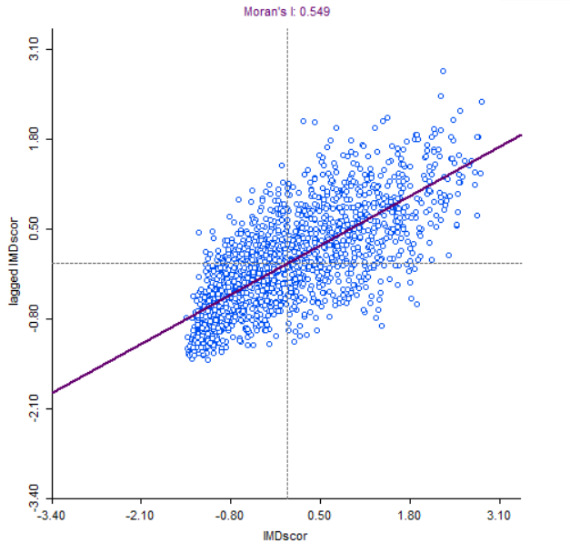
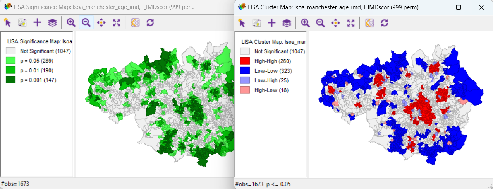
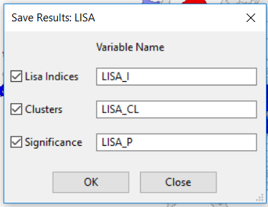
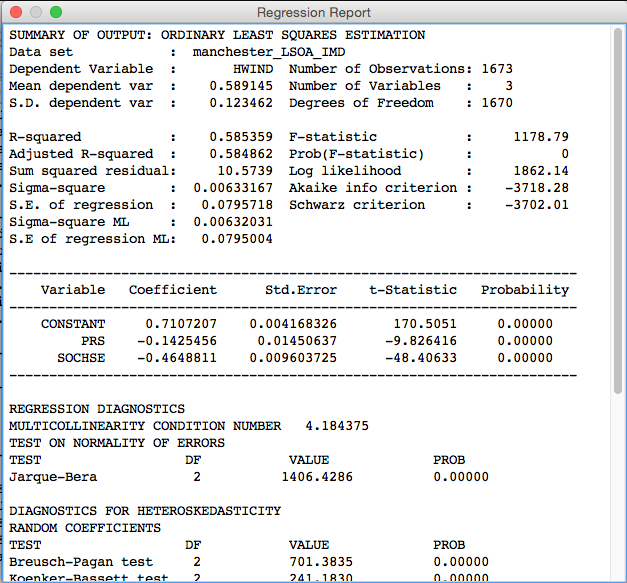

Learning Outcomes: | R Functions & Libraries:  
-------- | --------  
Export data from R with projection information |  `writeOGR()` (pg. 3)  
Understand Linked Displays in GeoDa  |  *brushing* (pg. 3)  
Perform Local Indicators of Spatial Autocorrelation in GeoDa | *LISA* (pg. 5)  
Perform Regression in R & GeoDa | `lm()` (pg. 8)  
Understand how to read in a variety of formats | `readOGR()` (pg. 10)  
Know how to reorder data | `order()` (pg. 13)  
Understand creating and using functions within R | `function ()` (pg. 14)  
Know how to use buffers within R  | `gBuffer()` (pg. 15)  
<!-- Tables have a max line length, if it is too long, the table gets shrunk -->


#1. Mapping Recap

We are going to be looking at a range of data for Greater Manchester and we'll be using both RStudio and GeoDa. 

This is a good time to remind you about using scripts (i.e. make sure you use one!). It's also a good idea to use the project facility within RStudio. To do this, open RStudio, click **File > New Project...**. Then click **New Directory > Empty Project**, select a folder (e.g. Documents) and then type a new folder name where the project will be saved. Finally click **Create Project**. This will be your working directory. 

First, let's load one of the libraries we need. 

```{r, message=FALSE, display=FALSE, comment = NA, display = FALSE}
library(rgdal)
```

Next, read in some data and plot the data.

```{r, message=FALSE, display=FALSE, comment=NA, warning=FALSE, results='hide'}
#download data
  download.file("http://www.nickbearman.me.uk/data/r/GreaterManchester_lsoa_2011.zip",
                "GreaterManchester_lsoa_2011.zip")
#unzip
  unzip("GreaterManchester_lsoa_2011.zip")
#read in data
  manchester_lsoa <- readOGR(".", "GreaterManchester_lsoa_2011")
```

```{r, message=FALSE, display=FALSE, comment=NA, warning=FALSE}
#plot data
  plot(manchester_lsoa)
```

We are using `readOGR()` instead of `readShapeSpatial()` as this looks at the projection information as well; have a look at `manchester_lsoa@proj4string` to check. The function `readOGR()` has two parameters in this example - the folder the data is in (`data`) and the file name (`GreaterManchester_lsoa_2011`). If the shapefile was in the working folder (i.e. not in a subfolder) you would replace the folder name with `"."`. 

Each LSOA has a code and a name, we are looking at a range of IMD values; we need to join the spatial data to the attribute data. Download the IMD data from http://bit.ly/2kFAlex (or https://www.gov.uk/government/uploads/system/uploads/attachment_data/file/467774/File_7_ID_2015_All_ranks__deciles_and_scores_for_the_Indices_of_Deprivation__and_population_denominators.csv). This file contains the IMD data for 2015 for all LSOAs in England.

*There are 3 measures in this data - the IMD score, rank and decile. We will primarily be using the score, where the area with the highest score is the most deprived (with a rank of 1 and in the first decile).*

Download the CSV file to your working directory, rename it to something more sensible and read it in:

*Renaming files with long names to a much shorter file name is a good way of avoiding typos.*

```{r, echo=FALSE}
imd <- read.csv("data/File_7_ID_2015_All_ranks__deciles_and_scores_for_the_Indices_of_Deprivation__and_population_denominators.csv", header = TRUE)
```

```{r, eval=FALSE}
imd <- read.csv("imd.csv", header = TRUE)
```

Using `head(imd)` we can see some of the field names are rather long. Shorten them in RStudio (using the code below). For the moment we only need the IMD Score, Rank and Decile fields. Delete the others and we can always add them back in later if we need them *(this is an advantage of having a well-commented script!)*. 

```{r, comment = NA}
imd <- imd[,1:7]
colnames(imd) <- c("LSOAcode","LSOAname","LADcode","LADname","IMDscore","IMDrank","IMDdecile")
```

Next, we need to join the data together. 

```{r, comment = NA}
manchester_lsoa@data <- merge(manchester_lsoa@data,imd,by.x="CODE",by.y="LSOAcode", all.x=TRUE)
```

You should have something like this:

```{r, comment = NA}
head(manchester_lsoa@data)
```

We can also now plot the IMD score across Greater Manchester (this code should be familiar to you!):

```{r, comment = NA, display = FALSE, message = FALSE, warning=FALSE}
#load libraries
  library(maptools)
  library(classInt)
  library(RColorBrewer)
#select variable to map
  var <- manchester_lsoa@data[,"IMDscore"]
#set colours & breaks
  breaks <- classIntervals(var, n = 6, style = "fisher")
  my_colours <- brewer.pal(6, "Blues")
#plot map
  plot(manchester_lsoa, col = my_colours[findInterval(var, breaks$brks, all.inside = TRUE)], 
       axes = FALSE, border = rgb(0.8,0.8,0.8,0)) 
  #the 4th parameter in the RGB value is transparency and 
  #0 means transparent (so we don't get a border at all).
#draw legend
  legend(x = 350382, y = 392310, legend = leglabs(breaks$brks), fill = my_colours, 
         bty = "n", cex = 0.7)
#add a title
  title("Greater Manchester: IMD 2015 Score by LSOA")
```

Now we have a map of IMD by LSOA in Greater Manchester. 

**Make sure you are happy with the code you have used. Check the glossary, help in RStudio (`?functionname`) or Google for any functions you have not come across before.**

#2. Spatial Analysis

For the analysis, we are interested in the deprivation levels. First of all, let's have a look at the data in a program called GeoDa.

We need the IMD data to be joined to the LSOA shapefile for using it in GeoDa, so let's save our joined data frame as a shapefile. We can use the `writeOGR()` function to do this. The convention is very similar to `readOGR()` - see help (`?writeOGR`) for details.

```{r, comment=NA, eval = FALSE}
writeOGR(manchester_lsoa, ".", "manchester_LSOA_IMD", "ESRI Shapefile")
```

This will save a new shapefile in your working folder. We need to open this in GeoDa. Open GeoDa and click **File > New Project From > ESRI Shapefile (.shp)...**: 


GeoDa should open a map display of the data automatically. We can create a simple choropleth map in here by right clicking on the map and then select **Change Current Map Type**. Select **Natural Breaks > 5** and choose the variable to map (we want **IMDscore**). Then a classified map will appear, similar to one we have created in RStudio. 

Also open the attribute table { height=20 } and a histogram { height=20 } for `IMDscore`. GeoDa allows us to use brushing or linked displays. Select one of the larger bars in the histogram and you will see that the same entries are highlighted on the map and in the attribute table. You can also draw a box on the map (left-click and drag) and that will highlight the entries as well (you can drag the box around - hold down Control). 

*How is this different to interacting with the data in RStudio, or QGIS/ArcGIS if you have used those packages? Is it better / easier to use? Or harder to use?*

We will now perform some spatial analysis within GeoDa. There is some preparatory work to do beforehand, which is creating the spatial weights. This is how GeoDa works out which polygons are next to each other and which ones to include when running local analysis (these are how we define the 'neighbours', that I mentioned in the presentation).

Select **Tools > Weights Manager** and click **Create**.  The following screen is displayed. 

{ height=40% }

Select **Add ID Variable...** and accept the default name. You now need to choose the neighbourhood weight method.  Select **Queen Contiguity** and click **Create**.  The neighbourhood weight matrix is saved in a file.  A suggested name is given.  This is the LSOA shape file name with a suffix of .gal.  Select **Save** and after a few seconds you should see a message Weights file “manchester_LSOA_IMD.gal” created successfully. Click **OK** on this window and **Close** on the Weights File Creation window. The Weights Manager window should show the details of the neighbours you have just selected. 

Click **Histogram** and you can see how many neighbours each polygon has. In my data, five is the most common number of neighbours. Close this and the Weights Manager when you are happy with it. 

##Moran's I

We can now start to explore the spatial patterns of the model we want to develop.  Click on the **Space** item on the GeoDa menu.  First we are going to look at the global indicator of spatial autocorrelation.  Select the first menu item **Univariate Moran’s I**.  A list of variables is displayed.  Choose the `IMDscore` variable.  Select the weights file we created earlier. 

{ height=40% }

A new window opens with a scatterplot of the HWIND variable and the ‘lagged IMDscore’ variable.  The ‘lagged IMDscore’ variable is the value of the IMD Score for the selected neighbourhood and its neighbours as defined when we set the spatial weights.  The scatter-plot suggests a positive correlation between the variables.  This means that there is a weak positive spatial autocorrelation. It has a value of 0.2384 confirming this positive spatial autocorrelation. We will now look at the local indicators of spatial association.  

##Local Indicators of Spatial Association (LISA)

Select **Space > Univariate Local Moran's I**.  Select the `IMDscore` variable from the list displayed and select the weights file used earlier (it should be selected automatically).  A screen with three checkboxes is shown.  Check all three and click **OK**.  A number of windows are produced.  The scatterplot is the same as we produced in the previous section. The two maps shown below are produced.  You will probably need to expand them to full screen to see the legends and patterns displayed.

{ height=35% }

The first map shows the extent to which neighbouring areas are clustered:  
  
- red areas are neighbourhoods with a high proportion of deprived areas surrounded by similar neighbourhoods 
- darker blue areas are neighbourhoods with a low proportion of deprived areas surrounded by similar neighbourhoods 
- lighter blue areas are neighbourhoods with a low proportion of deprived areas surrounded by neighbourhoods with a high proportion of deprived areas 
- pink areas are neighbourhoods with a high proportion of deprived areas surrounded by neighbourhoods with a low proportion of deprived areas 
- white areas are neighbourhoods where the surrounding neighbourhoods do not generate a statistically significant relationship. 

The second map shows the level of statistical significance.  The values are 0.05, 0.01, 0.001 and 0.0001.

We can see that areas of high and low deprivation cluster together.

Now that we have the clustering output, we can save these to the shapefile and then load them into R to map or todo other analysis. *Moving data from one GIS application to another is something that happens regularly with some of the projects I am working on!* 

Right click on the map and choose **Save Results**. Tick all three boxes (to save all of the results). This will create a new variable in the shapefile for each of the results we are saving. It should look like this:

{ height=30% }

Open the attribute table and you can see the three new variables on the left hand side of the table. Click the save button to save the updated shapefile. 

Now we need to load this shapefile back into RStudio - some code I will let you work out for yourself!

```{r, comment = NA, echo = FALSE, message = FALSE, display = FALSE, warning = FALSE, results='hide'}
manchester_LSOA_IMD_cluster <- readOGR(".", "manchester_LSOA_IMD")
```

Your data should look like this:

```{r, comment = NA}
head(manchester_LSOA_IMD_cluster@data)
```

##Moran's I in R

For some analysis we don't need to leave RStudio. For example, we can do the Moran's I analysis within RStudio. To do this, we need another library:

```{r, comment=NA, message=FALSE, display=FALSE, warning = FALSE}
#load the library
  library(spdep)
#work out the neighbours
  manchester_lsoa_nb <- poly2nb(manchester_lsoa)
#reformat the list of neighbours to a weight matrix
  manchester_lsoa_lw <- nb2listw(manchester_lsoa_nb)
#run the test
  moran.test(manchester_lsoa@data$IMDscore, manchester_lsoa_lw)
```

This gives us the Moran's I statistic, as well as some associated variables. It is possible to run a whole range of analysis, which goes beyond the scope of this course. 

#Regression (optional exercise)

We can use a regression model to explore what other factors might be involved in deprivation levels. (Data and information from http://www.nickbearman.me.uk/data/r/regression.zip).

The data provided also has an additional indicator value ("hard working indicator") as well as IMD. This is calculated by dividing the employed full time population by the total population. We can run the regression analysis on either indicator value - IMD or hard working. There is a separate file that gives the definitions of the variables (`variables-hardwork.docx`). 

We can run the regression model in either GeoDa or R. I will briefly outline the steps for R and GeoDa below. More detailed instructions for GeoDa are available ('geoda-spatial-analysis.docx') and for R, there are many books and web resources available (for example, [http://www.statmethods.net/stats/regression.html](http://www.statmethods.net/stats/regression.html)). 

##Regression in R

In this example, we use the `manchester_LSOA_IMD_hardwork` file as as example. 

```{r, comment=NA, echo=FALSE, warning=FALSE, message = FALSE}
#download data
  download.file("http://www.nickbearman.me.uk/data/r/regression.zip","regression.zip")
#unzip
  unzip("regression.zip")
```
```{r, comment=NA, warning=FALSE, message = FALSE}
#load data
  manchester_hardwork <- readOGR(".", "manchester_LSOA_IMD_hardwork")

#set the variable we are predicting    
  hardwork <- manchester_hardwork@data$HWIND
#set the variable(s) we using to predict
  var <- cbind(SOCHE = manchester_hardwork@data$SOCHSE, PRS = manchester_hardwork@data$PRS)
  #SOCHE is social housing
  #PRS is private rented
#run the model  
  model <- lm(hardwork ~ var)
#output some results
  summary(model)

#setup for IMD being the predictor variable
  IMDscore <- manchester_hardwork@data$IMDscore
#run second model
  model2 <- lm(IMDscore ~ var)
#output results
  summary(model2)
```

The key information in this part of the output is the strength of the model in showing the association between hard working neighbourhoods and tenure, the measures of model fit and the coefficients.  For this exercise we are only going to focus on one of the model fit measures, the Akaike info criterion.  The documentation on GeoDa provides comprehensive information on regression outputs. 

- **R-squared and Adjusted R-squared**  
  the value suggests that this model explains 58% of the variance in hard working neighbourhoods
- **Akaike info criterion (AIC)**  
  AIC is an indicator that allows for comparison between models.  A lower value indicates a better fit.  The value of -3718.28 is on an absolute scale so larger negative numbers will suggest a better fitting model 
- **Coefficients**  
  These suggest the strength and nature of the association between the independent variables and the dependent variable.  As we are using tenure as our predictor these are relative to ownership.  Social housing (SOCHSE) is negatively associated with hard working neighbourhoods.  Assuming a linear relationship this model suggests that for each additional 1% of social housing in a neighbourhood there is a reduction of 0.46% in hard working people. The proportion in the private rented sector (PRS) is also significant and negatively associated with hard working neighbourhoods.

The next steps with Regression do depend on the type of data (numerical, categorical, ordinal or binary) as well as the origin and sample size of the data. We will not be going any further with regression today. 

##(Non-Spatial) Regression in GeoDa

We can also run the regression within GeoDa. When going through this, think about whether you find this easier or harder than performing the regression in RStudio. 

Select **Regression > Regression**.  

A screen now asks you to set the dependent and independent variables for your regression model. For the dependent variable select HWIND and use the right arrow to the right of the Select Variables box to confirm.  You may notice that the arrow buttons below this are now enabled.  Select SOCHSE and press the right arrow that is further down the screen. Repeat for the variable PRS. Check the Weights File box which should point to the spatial weights file we generated earlier (you will need to create this, using the process we covered earlier).  We are now going to run a standard regression on the association between hard working neighbourhoods and tenure. 

Click Run and View Results if necessary. 

{ height=60% }

The output is similar to that from RStudio, but with more diagnostics provided for multicollinearity, normality of errors and heteroscedasticity. These are also available for RStudio (have a look at the help, `?lm`, for more details). We will not be covering the interpretation of these today.

##Geographically Weighted Regression

Geographically Weighted Regression (GWR) develops the principle of applying a regression to spatial data by taking into account the spatial location of the data. It is a complex method, but it highlights how the regression model varies in different locations. 

For more details, see https://cran.r-project.org/web/packages/spgwr/ and related academic references (e.g. Fotheringham et al., 2002,  Geographically Weighted Regression:
The Analysis of Spatially Varying Relationships, [http://eu.wiley.com/WileyCDA/WileyTitle/productCd-0471496162.html](http://eu.wiley.com/WileyCDA/WileyTitle/productCd-0471496162.html). 


#Public Transport and Deprivation

Public transport has an important role to play in tackling deprivation. We can use RStudio to see where the trams in Manchester run and how they relate to deprived areas. 

Firstly, load the tramline data, available as a GeoJSON file. This is a different type of file to a shape file and is an XML based format (open it in Notepad if you are interested in how it is structured). `readOGR()` can read all sorts of file formats, so we can adapt the code easily. 

```{r, comment=NA, message=FALSE, warning=FALSE, results='hide'}
#download data
  download.file("http://www.nickbearman.me.uk/data/r/tram.zip","tram.zip")
#unzip
  unzip("tram.zip")
#read in tramline data
  tramlines <- readOGR(dsn = "tramlines.geojson", layer = "OGRGeoJSON")
#read in CSV with tram station locations
  tram_stations_CSV <- read.csv("metrolink-stations.csv", header = TRUE)
```

We also need the tram stations, which are only available as a CSV file with Eastings and Northings. 

Read the CSV file in (metrolink-stations.csv) and it should look like this:

```{r, comment=NA}
head(tram_stations_CSV)
```

We now need to convert this to a `SpatialPointsDataFrame`, like with the crime data in the Introduction course. 

From `head(tram_stations_CSV)`, we can see that the data consists of a number of columns, each with a heading. Two of these are called **X** and **Y** – these are the columns that give the coordinates (Eastings and Northings, as they are in BNG) of each station in the data you have just downloaded. There are also other columns, with various information. At the moment, the data is just in a data frame object - not any kind of spatial object.  To turn it into a SpatialPointsDataFrame, enter the following:

```{r, comment=NA,warning=FALSE,message=FALSE}
#extract coordinates
  coords <- cbind(Easting = tram_stations_CSV$X, Northing = tram_stations_CSV$Y)
#create spatialPointsDataFrame, removing coordinates from the @data element
#we can use the same projection information as manchester_lsoa as we know it is identical
  tram_stations <- SpatialPointsDataFrame(coords, tram_stations_CSV[, -(1:2)], 
                                    proj4string = manchester_lsoa@proj4string)
```

This creates a ```SpatialPointsDataFrame``` object. This second line (starting `coords`) prepares the coordinates into a form that the ```SpatialPointsDataFrame``` can use. The ```SpatialPointsDataFrame``` function on the forth line takes three arguments - the first is coordinates, created in the line above. The second argument is the data frame **minus** (i.e. not including) columns 1 and 2 - this is what ```-(1:2)``` indicates.  These columns provide all the non-geographical data from the data frame.  The third is the coordinate system that the data is currently in (British National Grid). The resulting object ```tram_stations``` is a spatial points geographical shape object,  whose points are each recorded crime in the data set you download.  

Try `head(tram_stations@data)` to see the attribute table, similar to earlier. 

We can also plot the data, on top of the Greater Manchester LSOAs. Note the change in colour (`col`) and size (`cex` for points and `lwd` for lines), to make the lines and stations more visible. We can also use different symbols, by substituting in `pch = 1` for `pch="."`. Try searching in Google "R plot pch" and see what the different options are. 

```{r, comment=NA,warning=FALSE,message=FALSE}
#plot LSOAs
plot(manchester_lsoa)
#plot tram lines, in blue
plot(tramlines, col = "blue", lwd = 5, add = TRUE)
#plot stations, in red
plot(tram_stations, pch = ".", col = "red", cex = 5, add = TRUE)
```

We can see what the deprivation level is at each tram station, using a point in polygon analysis. The points are the tram stations and the polygons are the LSOAs. 

```{r, comment=NA,warning=FALSE,message=FALSE,error=FALSE}
# This is another R package, allowing GIS overlay operations
  library(rgeos) 
# this extracts the tram stations that are over the LSOAs (all of them in our case)
  z <- tram_stations[!is.na(over(tram_stations, geometry(manchester_lsoa))),]
# this takes the attribute data from the LSOA that contain the tram_stations, 
  #and adds it to the data frame of z     
    z@data <- data.frame(z@data, na.omit(over(tram_stations, manchester_lsoa)))
#this copies the project from tram_stations to z    
    z@proj4string <- tram_stations@proj4string
#copy z to tram_stations_joined
    tram_stations_joined <- z
#preview data
    head(tram_stations_joined)
```

Z is just a temporary variable to hold the updated tram_stations information. If we wanted to be tidy, we should really delete the z variable when we have finished: `rm(z)` 

##Reordering data

There is an `order()` function in R that allows us to reorder data. This is particularly useful if we want to display the 10 most and 10 least deprived stations! This code below creates a new variable with the data in a different order.

```{r, comment = NA}
tram_stations_joined_reordered <- tram_stations_joined[order(tram_stations_joined@data$IMDscore,
                                                             decreasing = TRUE),]
```

We can then plot the top and bottom 10 stations:

```{r, comment = NA}
plot(tram_stations_joined_reordered[1:10,], col = "red")
plot(tram_stations_joined_reordered[81:91,], col = "blue", add = TRUE)
```
  
So, which tram stop is the most deprived? and which is the least deprived?
  
```{r, comment = NA}
#most deprived
tram_stations_joined_reordered[1,]
#least deprived
tram_stations_joined_reordered[91,]
```

Can you create a map similar to this (see over), with the 10 most deprived stations in red and the top 10 least deprived stations in blue as well as identifying the most and least deprived stations? As an optional extra, see if you can include an appropriate legend and title.

```{r, comment = NA, echo=FALSE}
plot(tramlines)
plot(tram_stations, pch=".", cex = 3, add = TRUE)
plot(tram_stations_joined_reordered[1:10,], pch=".", cex = 5, col = "red", add = TRUE)
plot(tram_stations_joined_reordered[81:91,], pch=".", cex = 5, col = "blue", add = TRUE)
plot(tram_stations_joined_reordered[1,], pch=".", cex = 9, col = "red", add = TRUE)
plot(tram_stations_joined_reordered[91,], pch=".", cex = 9, col = "blue", add = TRUE)
```

##Creating a Function (optional exercise)

The code for doing a spatial join can easily be turned into a function within R. A function allows us to repeat a section of code with different data, without having to type out all of the lines again. This also hides some of the complexity from the user. For example, if we wanted to do a spatial join between railway stations and LSOAs, we could just substitute railway stations for trams. A function we have written ourselves works exactly the same way as many other functions we have used (`read.csv()`, `readOGR()`, etc.). Running a `SpatialJoin()` function we have written would look a bit like this:

```{r, comment=NA,warning=FALSE,message=FALSE, eval = FALSE}
tram_stations_joined <- SpatialJoin(tram_stations, manchester_lsoa)
```

Where `tram_stations` and `manchester_lsoa` are the parameters, `SpatialJoin` the function name and `tram_stations_joined` the output. Currently, if you ran the line above, R would give an error message, as it doesn't know what that function is. To create the function (and it will appear in the environment list on the right) run this code:

```{r, comment=NA,warning=FALSE,message=FALSE}
#function to join points with the attribute data of the polygons they overlay
SpatialJoin <- function(pts, polys) {
  #error checking
    if (!inherits(polys, "SpatialPolygonsDataFrame")) 
        stop("MUST BE SP SpatialPolygonsDataFrame OBJECT")
    if ((inherits(pts, "SpatialPointsDataFrame") | inherits(pts, "SpatialPoints")) == FALSE) 
        stop("Must be sp SpatialPointsDataFrame object")
  #extract points in overlay
    z <- pts[!is.na(over(pts, geometry(polys))),]
  #join attribute data  
    z@data <- data.frame(z@data, na.omit(over(pts,polys)) )
  #update projection
    z@proj4string <- pts@proj4string
  #return z
    z
}     
```

In a function it is common to use generic terms to refer to the inputs and outputs (e.g. pts, polys, z), because the function doesn't know (or care) whether we are dealing with tram stations or railway stations - it just cares that it is a point (or polygon) layer. 

This is where error checking comes in, which is what takes up the first half of the function. These check whether the poly variable is a polygon and the pts variable a points layer. If they are not, it will stop running and generate an error message. Try creating the function and running it. 

We can then repeat the process of working out which train station is the most and least deprived. The train stations for Manchester are included in the tram.zip file as rail-stations.geojson (originally from https://data.gov.uk/dataset/metrolink-and-rail-stations). Try writing the code to read the data in, join it, reorder it and display it on the map. 


##Tram Stop Buffers

Currently we have been looking at just the LSOA each tram stop is within. However we could look at the LSOAs that are within a set distance (for example a 15 minute walk) of each tram stop. Why do you think we might we want to do this?

For this, we need to use a buffer - a circle of a set distance around each tram stop. At a speed of 3 mph, this is equal to about 1.2km. We can use the `gBuffer` function, from the `rgeos` library. 

```{r, comment = NA}
#plot the tram stations
  plot(tram_stations_joined)
#calculate the buffer (distance is 1200 meters)
  tram_stations_joined_buffer <- gBuffer(tram_stations_joined, width = 1200, byid = TRUE)
#plot the buffer (add to existing plot)
  plot(tram_stations_joined_buffer, add = TRUE)
```

We now have the buffers (the circles) for each tram station. There are a number of different ways we can look at how the buffers and LSOAs relate to one another. We are going to look at a quite simple approach - convert the LSOAs to points and for each buffer take the average deprivation level of the LSOAs within the buffer. 

**There are a number of limitations with this method and this is something to think about as you work through this process: how could you do the analysis differently in the future?**

First, we need to convert the LSOA polygons into points. Fortunately, there is a function (`gCentroid()`) which is part of the `rgeos` package which will do this for us. This calculates the centre point (centroid) for each LSOA. The function creates a `SpatialPoints` variable, which doesn't have an attribute table (`@data`), so we need to copy this over manually.

```{r, comment = NA}
#convert polygons to points  
  manchester_lsoa_points <- gCentroid(manchester_lsoa, byid = TRUE)  
  plot(manchester_lsoa_points)
#create coordinates
  coords = data.frame(manchester_lsoa_points@coords[,1:2])
#create SpatialPointsDataFrame using coords and data
  manchester_lsoa_points <- SpatialPointsDataFrame(coords, data=data.frame(
    manchester_lsoa@data$IMDscore), proj4string= manchester_lsoa@proj4string)
#plot points  
  plot(manchester_lsoa_points)
#show head
  head(manchester_lsoa_points@data)
#plot first tram station
  plot(tram_stations_joined_buffer[1,])  
#plot lsoa points on top
  plot(manchester_lsoa_points, add = TRUE)  
```

Now we have the train stations buffers as polygons and the LSOAs as points (as shown in the plot above). We can do the overlay manually by plotting the different data sets on top of one another (as we did above). However, R is unable to link each tramstop with the LSOAs within the buffer. For this we need to get R to do the overlay and save the associated information - i.e. the average IMD score for each tram station, based on the buffer. 

```{r, comment = NA}
#Create point in polygon list
  o <- over(tram_stations_joined_buffer,manchester_lsoa_points,returnList=TRUE)
#View length of the list
  length(o)
#If we examine the object o, we will see also see that this comprises a list of dataframes. 
#The summary function tells you about an object - head, is used to wrap around the function 
#so only the first six elements are shown
  head(summary(o))
#View an item from the list (in this case sixth) (i.e. the sixth tram station and all of 
#the LSOAs that are linked with it)
  o[[6]]
#get a list of those LSOAs that are within this buffer using the rownames
#make them numeric
  row_o <- as.numeric(rownames(o[[6]]))
#plot tram station buffer number 6
  plot(tram_stations_joined_buffer[6,])
#Plot all the LSOA centroids
  plot(manchester_lsoa_points,pch=19,cex=.5,col="#7F7F7F",add=TRUE)
#Plot those LSOA centroids which are inside the buffer - i.e. we use the row_o to select the rows
  plot(manchester_lsoa_points[row_o,],pch=15,cex=1,col="#FF4500",add=TRUE)
```

This shows the tram station buffer (the circle), all of the LSOA centroids (grey dots) and those LSOA centroids within the buffer (red squares). For each tram buffer, we need to calculate the average IMD score, as we are likely to have a range of deprivation levels within the tram station buffer. The `colMeans()` function will calculate the mean value for each column (as you might have guessed!). We want to do this for each tram station buffer and the `lapply()` function allows us to do this - to apply a function (`colMeans()`) across the list of tram station buffers. We can then join this back onto the tram_stations data frame. 

```{r, comment = NA}
  average_deprivation <- lapply(o, colMeans)
#View the first six items from the list
  average_deprivation[1:6]
#collapse list back into a normal data frame
  tram_deprivation <- data.frame(matrix(unlist(average_deprivation),
                                        nrow=length(average_deprivation), byrow=T))
#Change the column names to something sensible
  colnames(tram_deprivation) <- c("average_deprivation")
#This should look like
  head(tram_deprivation)
#Join - the ordering has not been changed so this is valid
  tram_stations@data <- cbind(tram_stations@data,tram_deprivation)
#show data
  head(tram_stations@data)
```  

We now have the average deprivation for each tram stop. **How is this different to our previous measure? What are the limitations?** Plot a map of your results. 
  
- Discuss your results with a neighbour. How could the deprivation be calculated differently? 
- Try running the analysis with a different buffer. How easy is this within R compared to another GIS? 
- How about doing a polygon polygon overlay? How easy is this in R compared to another GIS? *See http://gis.stackexchange.com/questions/140504/extracting-intersection-areas-in-r for some interesting suggestions.*

*If you want to install additional libraries, you can do this, but on the University of Liverpool machines, it will only install onto that machine, so if you use a different machine you may need to rerun the installation command.*

##Future Developments (optional exercise)

We can extend this principle to look at groups of tram stops (either using just the stop location, or the buffer approach. For example, let's say there are some prospective new tram routes which could be built (see `future_tramlines` and `future_tramstops`).

We need to decide which route is the most important. For this exercise we are going to say that the route that gives access to the most deprived area(s) will be our recommended route (obviously there are many other factors that could be involved!). 

**Analyse the prospective new routes to see which reaches the areas with highest deprivation levels.**


  
  
  
This practical was written using GeoDa 1.8.12 and RStudio 1.0.136. 

This work is licensed under the Creative Commons Attribution-ShareAlike 4.0 International License. To view a copy of this license, visit http://creativecommons.org/licenses/by-sa/4.0/deed.en. The latest version of the PDF is available from https://github.com/nickbearman/confident-spatial-analysis. This version was created on `r format(Sys.time(), '%d %B %Y')`. 
