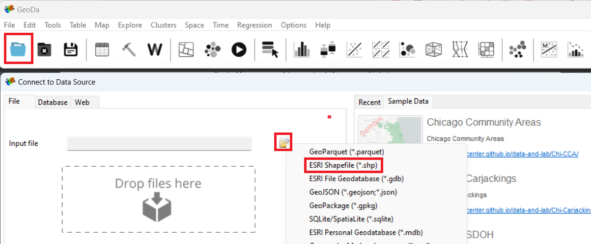
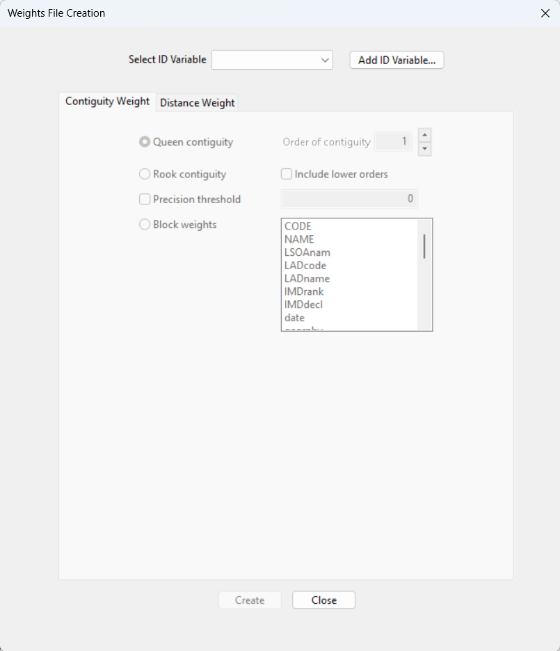

```{r setup, echo=FALSE}
#set working directory to /data-user
knitr::opts_knit$set(root.dir = 'C:/Users/nick/Documents/work/confident-spatial-analysis/data-user')
#knitr::opts_knit$set(root.dir = '/home/nickbearman/work/confident-spatial-analysis/data-user')
```

Learning Outcomes: | R Functions & Libraries:  
-------- | --------  
Understand Linked Displays in GeoDa  |  *brushing* (pg. 1)  
Perform Local Indicators of Spatial Association | *LISA* (pg. 3)   
Understand how to read in a variety of formats | `st_read()` (pg. 8)  
Perform a spatial join | `st_join()` (pg. 14)
Know how to reorder data | `order()` (pg. 15) 
Know how to use buffers within R  | `st_buffer()` (pg. 17)   
<!-- Understand creating and using functions within R | `function ()` (pg. 13)  -->  
<!-- Tables have a max line length, if it is too long, the table gets shrunk -->


# Practical 1: Spatial Analysis

We are going to be performing some Exploratory Data Analysis using a program called GeoDa. The data we are using covers Manchester, UK. 

For the analysis, we are interested in the deprivation levels. First of all, let's have a look at the data in a program called GeoDa.

Download the `tramp.zip` data the website and extract the zip file. 

- Click **Start > GeoDa** 
- When GeoDa opens, click on the folder icon 
- Select **ESRI Shapefile (.shp)** 
- Browse to and open **lsoa_manchester_age_imd.shp** 

{ height=30% }


GeoDa should open a map display of the data automatically. We can create a simple choropleth map in here by right clicking on the map and then select **Change Current Map Type**. Select **Natural Breaks > 5** and choose the variable to map (we want **IMDscor**). Then a classified map will appear, similar to one we have created in RStudio. 

Also open the attribute table { height=20 } and a histogram { height=20 } for `IMDscor`. GeoDa allows us to use brushing or linked displays. Select one of the larger bars in the histogram and you will see that the same entries are highlighted on the map and in the attribute table. You can also draw a box on the map (left-click and drag) and that will highlight the entries as well (you can drag the box around). 

*How is this different to interacting with the data in RStudio, or QGIS/ArcGIS if you have used those packages? Is it better / easier to use? Or harder to use?*

We will now perform some spatial analysis within GeoDa. There is some preparatory work to do beforehand, which is creating the spatial weights. This is how GeoDa works out which polygons are next to each other and which ones to include when running local analysis (these are how we define 'neighbours', as I mentioned in the presentation).

Select **Tools > Weights Manager** and click **Create**.  The following screen is displayed. 

{ height=40% }

- Select **Add ID Variable...** and accept the default name.  
- You now need to choose the neighbourhood weight method.  Select **Queen Contiguity** and click **Create**.  
- The neighbourhood weight matrix is saved in a file.  A suggested name is given.  This is the LSOA shape file name with a suffix of .gal.  Select **Save** and after a few seconds you should see a message **Weights file `lsoa_manchester_age_imd.gal` created successfully**.  
- Click **OK** on this window and **Close** on the Weights File Creation window. The Weights Manager window should show the details of the neighbours you have just selected. 

Click { height=20 } and you can see how many neighbours each polygon has. In my data, five is the most common number of neighbours. Close this and open the **Connectivity Map**, which shows the neighbours for each polygon. Close this and the Weights Manager when you are happy with it. 

## Moran's I

We can now start to explore the spatial patterns of the model we want to develop.  Click on the **Space** item on the GeoDa menu.  First we are going to look at the global indicator of spatial autocorrelation.  Select the first menu item **Univariate Moran's I**.  A list of variables is displayed.  Choose the `IMDscor` variable.  Select the weights file we created earlier. 

{ height=40% }

A new window opens with a scatterplot of the IMDscor variable and the lagged IMDscor variable.  The lagged IMDscor variable is the value of the IMD Score for the selected neighbourhood and its neighbours as defined when we set the spatial weights.  The scatter-plot suggests a positive correlation between the variables.  This means that there is a weak positive spatial autocorrelation. It has a value of 0.253 confirming this positive spatial autocorrelation. We will now look at the local indicators of spatial association.  

## Local Indicators of Spatial Association (LISA)

- Select **Space > Univariate Local Moran's I**. 
- Select the `IMDscor` variable from the list displayed and select the weights file used earlier (it should be selected automatically). 
- A screen with three checkboxes is shown.  Check all three and click **OK**.  A number of windows are produced. 
- The scatterplot is the same as we produced in the previous section. The two maps shown below are produced.  You will probably need to expand them to full screen to see the legends and patterns displayed. 

{ height=35% }

The first map shows the extent to which neighbouring areas are clustered:  
  
- red areas are neighbourhoods with a high proportion of deprived areas surrounded by similar neighbourhoods 
- darker blue areas are neighbourhoods with a low proportion of deprived areas surrounded by similar neighbourhoods 
- lighter blue areas are neighbourhoods with a low proportion of deprived areas surrounded by neighbourhoods with a high proportion of deprived areas 
- pink areas are neighbourhoods with a high proportion of deprived areas surrounded by neighbourhoods with a low proportion of deprived areas 
- white areas are neighbourhoods where the surrounding neighbourhoods do not generate a statistically significant relationship. 

The second map shows the level of statistical significance.  The values are 0.05, 0.01 and 0.001.

We can see that areas of high and low deprivation cluster together.

Now that we have the clustering output, we can save these to the shapefile and then load them into R to map or to do other analysis. *Moving data from one GIS application to another is something that happens regularly with many of the projects I am working on!* 

Right click on the map and choose **Save Results**. Tick all three boxes (to save all of the results). This will create a new variable in the shapefile for each of the results we are saving. It should look like this:

{ height=20% }

Open the attribute table within GeoDa { height=20 } and you can see the three new variables on the right hand side of the table. Click the Save button { height=20 } to save the updated shapefile. 

## LISA in R (optional exercise)

There is a library for R, that allows us to do many of the GeoDa analyses inside R. It is called `rgeoda` and more details are at: 
https://geodacenter.github.io/rgeoda/. There is also a very good tutorial at https://geodacenter.github.io/rgeoda/articles/rgeoda_tutorial.html which I'd recommend if you are interested in more details. 

To mirror the LISA analysis we did in GeoDa, load the libraries. Remember to install the `rgeoda` package if you need to: 

```{r, message=FALSE, warning=FALSE, comment=NA, display=FALSE, results='hide'}
library(rgeoda)
library(sf)
library(tmap)
```

Load the `lsoa_manchester_age_imd.shp` file from the `trams.zip` file:


```{r}
#read in shapefile
manchester_lsoa <- st_read("lsoa_manchester_age_imd.shp")
```

Calculate the spatial weights: We are using Queen weights by default, but there are also many other options. 

```{r}
# Calculate Spatial Weights
queen_w <- queen_weights(manchester_lsoa)
summary(queen_w)
```

If we want to, we can intergrate the neighbours of a specific polygon:


```{r}
# To access the details of the weights: e.g. list the neighbors of a specified observation:
nbrs <- get_neighbors(queen_w, idx = 1)
cat("\nNeighbors of the 1-st observation are:", nbrs)
```

We can also perform our LISA calcuation. We need to extract the column we want to use (`IMDscor`) and then use that with the existing weights variable:

```{r}
# Calculating Local Indicators of Spatial Association–LISA
# Local Moran

manchester_IMD <- manchester_lsoa["IMDscor"]
lisa <- local_moran(queen_w, manchester_IMD)
```

This `lisa` object contains all of the results, and we can access them using a number of commands:

```{r, comment=NA,warning=FALSE,message=FALSE,error=FALSE}
#Get the values of the local Moran's I
lms <- lisa_values(gda_lisa = lisa)
```

```{r, comment=NA,warning=FALSE,message=FALSE,error=FALSE,eval=FALSE}
lms
```

I think these are the input values for creating a Moran's I graph like we did in GeoDa, but I don't think we can currently do this using the `rgeoda` library. Let me know if you discover a way of doing this! See *Morans I in R* for an example of this using the `sp` libray. 

```{r, comment=NA,warning=FALSE,message=FALSE,error=FALSE}
#get the pseudo-p values of significance of local Moran computation, the green signifiance map
pvals <- lisa_pvalues(lisa)
```

```{r, eval=FALSE}
pvals
```

```{r, comment=NA,warning=FALSE,message=FALSE,error=FALSE}
#get the cluster indicators of local Moran computation, the blue-red map values
cats <- lisa_clusters(lisa, cutoff = 0.05)
```

```{r, eval=FALSE}
cats
```

These are stored as values of `0` to `4`, accessible through:

```{r}
lbls <- lisa_labels(lisa)
lbls
```
*Formally, there are also values `5` and `6` althgouh they are rarley used, and not present in our data for Greater Manchester.* 

We can also then map our data:

```{r}
#join labels on to the data
  manchester_lsoa$lisaCats <- cats
  head(manchester_lsoa)

# access colours and labels
  lisa_colors <- lisa_colors(lisa)
  lisa_labels <- lisa_labels(lisa)

#draw map
  tm_shape(manchester_lsoa) + 
    tm_polygons("lisaCats", palette = lisa_colors[1:5], labels = lisa_labels[1:5])
```
We have restricted the colours and labels to the first five (`[1:5]`) because we do not need numbers `6` and `7` for this data. 

For more information on the mapping, see ttps://geodacenter.github.io/rgeoda/articles/rgeoda_tutorial.html#exploratory-spatial-data-analysis. 

\newpage

# Practical 2: Spatial Decision Making

We are going to be looking at a range of data for the tram system in Greater Manchester using spatial joins and spatial overlays RStudio. 

Now is a good time to remind you about using scripts (i.e. make sure you use one!). It's also a good idea to use the project facility within RStudio. To do this, open RStudio, click **File > New Project...**. Then click **New Directory > Empty Project**, select a folder (e.g. Documents) and then type a new folder name where the project will be saved. Finally click **Create Project**. This will be your working directory. Projects allow RStudio to keep related files (e.g. scripts) together. 

### Plotting maps using `sf`

First, we are going to plot our data. This is a quick recap from previous work, but it is worth doing. Let's load the libraries we need. 

```{r, message=FALSE, display=FALSE, comment = NA, display = FALSE}
library(sf)
library(tmap)
```

We are also going to be using data from `tram.zip`. Download and extract the data into your working directory. 

Next, read in some data and plot the data.

```{r, message=FALSE, display=FALSE, comment=NA, warning=FALSE, results='hide'}
#read in data
  manchester_lsoa <- st_read("lsoa_manchester_age_imd.shp")
  
```

```{r, message=FALSE, display=FALSE, comment=NA, warning=FALSE}
#plot data
  qtm(manchester_lsoa)
```

Also, checkout what attributes we have in the data:

```{r, message=FALSE, display=FALSE, comment=NA, warning=FALSE}
  head(manchester_lsoa)
```

We have a selection of different columns here. Of particular note are the `IMDscor`, `IMDrank` and `IMD decl` columns - containing IMD data (score, rank and decile). We also have the total number of people in each LSOA (`AllUslR`) and the population in a range of age groups. The age data we have used before - see [Introduction to Spatial Data & Using R as a GIS](https://github.com/nickbearman/intro-r-spatial-analysis) course for details.  

The IMD data is new. This is the Index of Multiple Deprivation, and consists of a measure of deprivation for each LSOA. <!-- More details on IMD --> 

*There are 3 measures in this data - the IMD score, rank and decile. We will primarily be using the score, where the area with the highest score is the most deprived (with a rank of 1 and in the first decile).*

We can map this data by adapting our mapping code:

```{r, message=FALSE, display=FALSE, comment=NA, warning=FALSE}
tm_shape(manchester_lsoa) +
  tm_polygons("IMDscor", title = "IMD Score", palette = "Blues", style = "jenks") +
  tm_layout(legend.title.size = 0.8)
```

Now we have a map of IMD by LSOA in Greater Manchester. 


## Public Transport Services

Public transport has an important role to play in tackling deprivation. We can use RStudio to see where the trams in Manchester run and how they relate to deprived areas. 
We have a selection of tram data available in the `tram.zip` file we downloaded earlier. 
  
Load the tram line data:
  
```{r, comment=NA, message=FALSE, warning=FALSE, results='hide'}
# read in tramlines
  tramlines <- st_read("Metrolink_Lines_Functional.shp")
```

We also need the tram stations, which are only available as a CSV file with Eastings and Northings:

```{r, comment=NA, message=FALSE, warning=FALSE, results='hide'}
#read in CSV with tram station locations
  stations_CSV <- read.csv("TfGMMetroRailStops.csv", header = TRUE)
```

It should look like this:

```{r, comment=NA}
head(stations_CSV)
```

This data file actually contains both Railway stations and Tram stations. For this work, we only need the tram station data, so let's create a subset. Have a look at the data:

```{r comment=NA, eval=FALSE}
View(stations_CSV)
```

`View()` is a handy function that allows us to view the data in a scrollable window. Very useful for data exploration. Note that there is a column called `NETTYP` which has two values - `M` for Metrolink station and `R` for railway station. 

We can use the `which()` function to select out which rows are metrolink stations:

```{r, comment=NA}
which(stations_CSV$NETTYP == "M")
```

However this just gives us a list of numbers - in fact, the index numbers. If we run `stations_CSV[92,]`, it will show us just row 92, a Metrolink station called `Abraham Moss`. 

We can use this to do a subset of the data - select out these ones, and save them as a new variable:

```{r, comment=NA}
#subset out Metrolink stations
metrolink_stations_CSV <- stations_CSV[which(stations_CSV$NETTYP == "M"),]
head(metrolink_stations_CSV)
```

We now need to convert this to a `sf` layer, like we did with the crime data in the Introduction course. 

From `head(metrolink_stations_CSV)`, we can see that the data consists of a number of columns, each with a heading. Two of these are called **GMGRFE** and **GMGRFN**. These are the columns that give the coordinates (Eastings, column ending in `E` and Northings, column ending in `N`) in the British National Grid Coordinate Reference System of each station. 

There are also other columns, with various information. At the moment, the data is just in a data frame object - not any kind of spatial object. The numbers in the columns are just numbers. R doesn't know they are coordiantes (and therefore spatial data) until we explicially tell it.

To turn it into a spatial layer, enter the following:

```{r, comment=NA,warning=FALSE,message=FALSE}
#make as a sf layer
tram_stations <- st_as_sf(metrolink_stations_CSV, coords = c('GMGRFE', 'GMGRFN'), crs = 27700)
```

This function `st_as_sf() is a generic function allowing us to create `sf` objects. In this case it takes the `metrolink_stations_CSV` variable, extracts the coodinates `coords = c('GMGRFE', 'GMGRFN')` and sets the CRS to British National Grid ` crs = 27700`. 

Try `head(tram_stations)` to see the attribute table, similar to earlier. 

We can also plot the data, on top of the Greater Manchester LSOAs. 

```{r, comment=NA,warning=FALSE,message=FALSE}
#plot just tram stations
tm_shape(tram_stations) +
  tm_dots(tram_stations, size = 0.1, shape = 19, col = "darkred") 
#plot tram stations and tram lines, for context
tm_shape(tram_stations) +
  tm_dots(tram_stations, size = 0.1, shape = 19, col = "darkred") +
tm_shape(tramlines) +
  tm_lines(col = "black")
#plot tram stations and LSOAs
tm_shape(tram_stations) +
  tm_dots(tram_stations, size = 0.1, shape = 19, col = "darkred") + 
  tm_shape(manchester_lsoa) +
  tm_borders()

```

## IMD of Tram Station Catchment Areas

Now we know where the tram stations are, and we can overlay that with the LSOA data as we showed in the previous map. 

<!-- === -->

We can see what the deprivation level is at each tram station, using a point in polygon analysis. The points are the tram stations and the polygons are the LSOAs. 

```{r, comment=NA,warning=FALSE,message=FALSE,error=FALSE}
#spatial join
stations_in_LSOA <- st_join(tram_stations, manchester_lsoa)

#view the data
View(stations_in_LSOA)
```

At the moment, we have just picked one tram stations for each LSOA. Most LSOAs only have one tram station in them, so this isn't a problem. 

However some LSOAs will have more than one tram station in them. We can see this by counting how many tram stations are in each LSOA: 

*We will need to use the `dplyr` library for this - make sure you install it if you haven't got it already*

```{r, comment=NA,warning=FALSE,message=FALSE,error=FALSE}
#count stations in LSOA
library(dplyr)
stations_in_LSOA_count <- count(as_tibble(stations_in_LSOA), NAME)
```

The easiest way to view this is to open it in a `View()` tab:

```{r, comment=NA,warning=FALSE,message=FALSE,error=FALSE,eval=FALSE}
View(stations_in_LSOA_count)
```

We can then also sort the columns - click on the arrows (IMG) by the **n** column. You can see several LSOAs have more than one tram station within them, e.g. Manchester 054C. 

If you look for Manchester 054C in the `stations_in_LSOA` variable - again, easiest in a `View()` tab and reorder the data - then you can see the LSOA Manchester 054C is listed three times, against each tram station it is in: **Exchange Square, Market Street and Victoria**. 

This is not a specific problem with our analysis - so we are fine to carry on - but we will come back to this later on. 


## Showing Most and Least Deprived Stations

So how do we show the stations with the most and least depirved catchment areas on the map? When reordering bits in the `View()` tab is useful for exploring, this isn't saved. We can use a different function to do this. 

There is an `order()` function in R that allows us to reorder data. This is particularly useful if we want to display the 10 most and 10 least deprived stations! This code below creates a new variable with the data in a different order.

```{r, comment = NA}
stations_in_LSOA <- stations_in_LSOA[order(stations_in_LSOA$IMDscor, decreasing = TRUE), ]
```

We can then plot the top and bottom 10 stations. Note that there are 99 stations in our data frame, so `[1:10,]` gives us the top ten (most deprived) and `[89:99,]` will give us the bottom tem (least deprived):

```{r, comment = NA}
#plot stations
tm_shape(stations_in_LSOA) +
  tm_dots(stations_in_LSOA, size = 0.1, shape = 19, col = "darkred") 

#show top / bottom stations
tm_shape(stations_in_LSOA) +
  tm_dots(size = 0.1, shape = 19, col = "darkred") +
  tm_shape(stations_in_LSOA[1:10,]) +
  tm_dots(size = 0.1, shape = 19, col = "red") +
  tm_shape(stations_in_LSOA[89:99,]) +
  tm_dots(size = 0.1, shape = 19, col = "blue") 
```
  
So, which tram stop is the most deprived? and which is the least deprived?
  
```{r, comment = NA,warning=FALSE,message=FALSE,error=FALSE, results='hide'}
#most deprived
stations_in_LSOA[1,]
#least deprived
stations_in_LSOA[99,]
```

<!-- DROPPED STILL SP
## Creating a Function (optional exercise)

The code for doing a spatial join can easily be turned into a function within R. A function allows us to repeat a section of code with different data, without having to type out all of the lines again. This also hides some of the complexity from the user. For example, if we wanted to do a spatial join between railway stations and LSOAs, we could just substitute railway stations for trams. A function we have written ourselves works exactly the same way as many other functions we have used (`read.csv()`, `readOGR()`, etc.). Running a `SpatialJoin()` function we have written would look a bit like this:

```{r, comment=NA,warning=FALSE,message=FALSE, eval = FALSE}
tram_stations_joined <- SpatialJoin(tram_stations, manchester_lsoa)
```

Where `tram_stations` and `manchester_lsoa` are the parameters, `SpatialJoin` the function name and `tram_stations_joined` the output. Currently, if you ran the line above, R would give an error message, as it doesn't know what that function is. To create the function (and it will appear in the environment list on the right) run this code:

```{r, comment=NA,warning=FALSE,message=FALSE}
#function to join points with the attribute data of the polygons they overlay
SpatialJoin <- function(pts, polys) {
  #error checking
    if (!inherits(polys, "SpatialPolygonsDataFrame")) 
        stop("MUST BE SP SpatialPolygonsDataFrame OBJECT")
    if ((inherits(pts, "SpatialPointsDataFrame") | inherits(pts, "SpatialPoints")) == FALSE) 
        stop("Must be sp SpatialPointsDataFrame object")
  #extract points in overlay
    z <- pts[!is.na(over(pts, geometry(polys))),]
  #join attribute data  
    z@data <- data.frame(z@data, na.omit(over(pts,polys)) )
  #update projection
    z@proj4string <- pts@proj4string
  #return z
    z
}     
```

In a function it is common to use generic terms to refer to the inputs and outputs (e.g. pts, polys, z), because the function doesn't know (or care) whether we are dealing with tram stations or railway stations - it just cares that it is a point (or polygon) layer. 

This is where error checking comes in, which is what takes up the first half of the function. These check whether the poly variable is a polygon and the pts variable a points layer. If they are not, it will stop running and generate an error message. Try creating the function and running it. 

We can then repeat the process of working out which train station is the most and least deprived. The train stations for Manchester are included in the tram.zip file as `rail-stations.geojson` (originally from https://data.gov.uk/dataset/metrolink-and-rail-stations). Try writing the code to read the data in, join it, reorder it and display it on the map. 


-->
 <!-- === -->
 
## Tram Stop Buffers

Currently we have been looking at just the LSOA each tram stop is within. However if we overlay each tram stop (as a point) we can see that assuming that people come from the LSOA it is in might not be a good idea. 

<!-- add example --> 

we could look at the LSOAs that are within a set distance (for example a 15 minute walk) of each tram stop. Why do you think we might we want to do this?

<!-- Some LSOAs are quite small, and people from nearby LSOAs might use that tram stop as well. -->

To look at the LSOAs within a set distance, we can use a tool called a buffer. This creates a circle at a set distance around a point. So how big a buffer should we create? How far are people likley to walk to get to their nearest tram stop? Let's say people will talk for 10 min. At a speed of 3 mph, this is equal to about 1.2km. We can use the `st_buffer` function to generate a buffer of 1.2km (1200 m). 

```{r, comment = NA}
#plot the tram stations
  qtm(tram_stations)
#calculate the buffer (distance is 1200 meters)
  tram_stations_1200_buffer <- st_buffer(tram_stations, 1200)
#plot the buffer
  qtm(tram_stations_1200_buffer)
```

We now have the buffers (the circles) for each tram station. 

```{r, comment = NA}
# overlay one tram stop and the LSOAs
#plot the buffer, lsoas and tram stations
  tm_shape(tram_stations_1200_buffer[4,]) +
    tm_polygons() +
  tm_shape(manchester_lsoa) +
    tm_polygons(alpha=0.1) +
  tm_shape(tram_stations[4,]) +
    tm_dots()
```

See how our 1.2km buffer around a tram station covers a number of different LSOAs. Additionally some LSOAs are completely covered, and some are only partially covered. 

There are a number of different ways we can look at how the buffers and LSOAs relate to one another. We are going to look at a quite simple approach - convert the LSOAs to points and for each buffer use a point in polygon analysis to take the average deprivation level of the LSOAs (points) within the buffer. 

**There are a number of limitations with this method and this is something to think about as you work through this process: how could you do the analysis differently in the future?**

First, we need to convert the LSOA polygons into points. Fortunately, there is a function (`st_centroid()`) which will do this for us. This calculates the centre point (centroid) for each LSOA. The function creates a `sf` data frame.

```{r, comment = NA}
#convert polygons to points  
  manchester_lsoa_points <- st_centroid(manchester_lsoa) 
#plot points
  qtm(manchester_lsoa_points)
#plot points and LSOA
  tm_shape(manchester_lsoa) +
  tm_borders(col = "red") +
  tm_shape(manchester_lsoa_points) +
  tm_dots(manchester_lsoa_points, size = 0.1, shape = 19, col = "darkred") 
```

We also still have the IMD data in the variable:

```{r, comment = NA}
View(manchester_lsoa_points)
```

Now we have the train stations buffers as polygons and the LSOAs as points (as shown in the plot above). We can do the overlay manually by plotting the different data sets on top of one another. 

```{r, comment = NA}
#map of one station buffer with LSOA points in it
tm_shape(tram_stations_1200_buffer[1,]) +
  tm_borders(col = "red") +
tm_shape(tram_stations[1,]) +
  tm_dots(size = 0.5) +
tm_shape(manchester_lsoa_points) +
  tm_dots(manchester_lsoa_points, size = 0.1, shape = 19, col = "darkred") +
tm_shape(manchester_lsoa) +
  tm_polygons(alpha=0.1)
```

However, to link the two we need to do a spatial join. This is similar to what we did earlier. 

```{r, comment = NA}
#st_join is a left join
#join each station to the LSOAs within the buffer
  tram_stations_IMD <- st_join(tram_stations_1200_buffer, manchester_lsoa_points)
  View(tram_stations_IMD)
```

Each station (`tram_stations_1200_buffer`) is listed multiple times - one for each LSOA (`manchester_lsoa_points`) which falls within the buffer. We can group this:

```{r, comment = NA}
#group by Station, take average IMDscore. 
  station_LSOA_IMD <- tram_stations_IMD %>% group_by(RSTNAM) %>% summarise(mean(IMDscor)) 
#view the average IMD score for each station
View(station_LSOA_IMD)
qtm(station_LSOA_IMD)
```

The `%>%` command (known as a pipe) is a piece of code from the tidyverse. It allows you to pass the output from one function in to another function. This is sometimes known as chaining commands together. Here, we take `tram_stations_IMD`, pass it to `group_by(RSTNAM)` and then pass on to `summarise(mean(IMDscor))`. 

Now we have each station buffer listed once, with the average IMD score (`mean(IMDscore)`). Currently they are still the buffers, which won't make sense to map, so we can convert them back to points (centriods):

```{r, comment = NA}
#still buffers (of each station), so convert to points (centriods)
station_LSOA_IMD_pt <- st_centroid(station_LSOA_IMD)
qtm(station_LSOA_IMD_pt)
```

Now we can map them:

```{r, comment = NA}
tm_shape(tram_stations_1200_buffer) +
  tm_borders(col = "red") +
  tm_shape(station_LSOA_IMD_pt) +
  tm_dots(station_LSOA_IMD_pt, size = 0.1, shape = 19, col = "darkred")
```

We can then reorder them, and map them according to the IMD:

```{r, comment = NA}
#reorder, most deprived at the top
station_LSOA_IMD_pt_ordered <- station_LSOA_IMD_pt[order(station_LSOA_IMD_pt$`mean(IMDscor)`, 
            decreasing = TRUE), ]

head(station_LSOA_IMD_pt_ordered)

#plot map of average IMD score by station (top 10 in Red, bottom 10 in Blue)
tm_shape(station_LSOA_IMD_pt_ordered) +
  tm_dots(station_LSOA_IMD_pt_ordered, size = 0.1, shape = 19, col = "darkred") +
  tm_shape(station_LSOA_IMD_pt_ordered[1:10,]) +
  tm_dots(station_LSOA_IMD_pt_ordered[1:10,], size = 0.1, shape = 19, col = "red") +
  tm_shape(station_LSOA_IMD_pt_ordered[89:99,]) +
  tm_dots(station_LSOA_IMD_pt_ordered[89:99,], size = 0.1, shape = 19, col = "blue") 
```


We now have the average deprivation for each tram stop. **How is this different to our previous measure?** 

<!-- show side by side: 

tm_shape(stations_in_LSOA) +
  tm_dots(size = 0.1, shape = 19, col = "darkred") +
  tm_shape(stations_in_LSOA[1:10,]) +
  tm_dots(size = 0.1, shape = 19, col = "red") +
  tm_shape(stations_in_LSOA[89:99,]) +
  tm_dots(size = 0.1, shape = 19, col = "blue") 

tm_shape(station_LSOA_IMD_pt_ordered) +
  tm_dots(station_LSOA_IMD_pt_ordered, size = 0.1, shape = 19, col = "darkred") +
  tm_shape(station_LSOA_IMD_pt_ordered[1:10,]) +
  tm_dots(station_LSOA_IMD_pt_ordered[1:10,], size = 0.1, shape = 19, col = "red") +
  tm_shape(station_LSOA_IMD_pt_ordered[89:99,]) +
  tm_dots(station_LSOA_IMD_pt_ordered[89:99,], size = 0.1, shape = 19, col = "blue") 

-->
  
- Discuss your results with a neighbour. How could the deprivation be calculated differently? 
- Try running the analysis with a different buffer. How easy is this within R to change the buffer to 1km (1000m) compared to another GIS? 


## Future Tram Expansion (optional exercise)

We can extend this principle to look at groups of tram stops (either using just the stop location, or the buffer approach. For example, let's say there are some prospective new tram routes which could be built (see `future_tramlines.geojson` and `future_tramstops.shp`).

Load the `future_tramlines.geojson`, which is available as a GeoJSON file. This is a different type of file to a shape file and is an XML based format (open it in Notepad if you are interested in how it is structured). `st_read()` can read all sorts of file formats, so we can adapt the code easily.   
  
```{r, comment=NA, message=FALSE, warning=FALSE, results='hide'}
#download data
  download.file("http://www.nickbearman.me.uk/data/r/tram.zip","tram.zip")
#unzip
  unzip("tram.zip")
#read in tramline data
  future_tramlines <- st_read(dsn = "future_tramlines.geojson")
```

When combined with the `future_tramstops.shp` file, we can see we have three different areas for expansion: Stockport Extension, Airport western loop and Port Salford. 

```{r, comment=NA, message=FALSE, warning=FALSE, results='hide'}
# read in data
  future_tramstops <- st_read("future_tramstops.shp")
# plot data
tm_shape(future_tramlines) +
  tm_lines() +
tm_shape(future_tramstops) +
  tm_dots(size = 0.1)
```


There is only funding to build one route, and we need to chose which one to build. For this exercise we are going to say that the route that gives access to the most deprived area(s) will be our recommended route (obviously there are many other factors that could be involved!). 

**Analyse the prospective new routes to see which reaches the areas with highest deprivation levels.**


## Polygon Polygon Overlay (optional exercise)

When we looked at which LSOAs were in the catchment area, we converted the polygons to points, and then either the LSOA was in the catchment area, or was not in the catchment area. However some LSOAs were only partially in the catchment area. Could we include this in our analysis somehow? 

One potential way is to use a weighted area calculation. This involves calculating the area of the LSOA that is inside the buffer (e.g. 68%) then incorporate this into the overall average using a weighted approach (e.g. 68% of the IMD score for that LSOA).

*This is a very common approached used with population, e.g. if 68% of the LSOA area is within the buffer zone, then it makes sense to assume 68% of the population could make use of the tram station.*

We can extend this to IMD score, with the assumption if 68% of one deprived area is within the tram station catchment area, but 100% of a different area is within the catchment area of a different tram station, it is more important to prioritise the deprived area with 100% coverage than the one with 68% coverage. Therefore a 100% weight is given to one, and only a 68% weight is given to another. 

- How about doing a polygon polygon overlay? How easy is this in R compared to another GIS? *See http://gis.stackexchange.com/questions/140504/extracting-intersection-areas-in-r for some interesting suggestions, particularly using sf at the bottom of the post. The answers are provided in `st_intersection_code.R` if you want to have a look. Try working out the code yourself first though!*

-----

  
This practical was written using R 4.2.0 (2022-04-22) and RStudio 2022.02.3 by Dr. Nick Bearman (nick@geospatialtrainingsolutions.co.uk). It has also been tested in R 4.2.0 (2022-04-22) and RStudio 2022.02.3 (RStudio Cloud).

This work (Confident Spatial Analysis and Statistics in R & GeoDa) is licensed under the Creative Commons Attribution-NonCommercial-ShareAlike 4.0 International License. To view a copy of this license, visit http://creativecommons.org/licenses/by-nc-sa/4.0/. 

The latest version of the PDF is available from https://github.com/nickbearman/confident-spatial-analysis. This is v6.0 and this was created on `r format(Sys.time(), '%d %B %Y')`.


